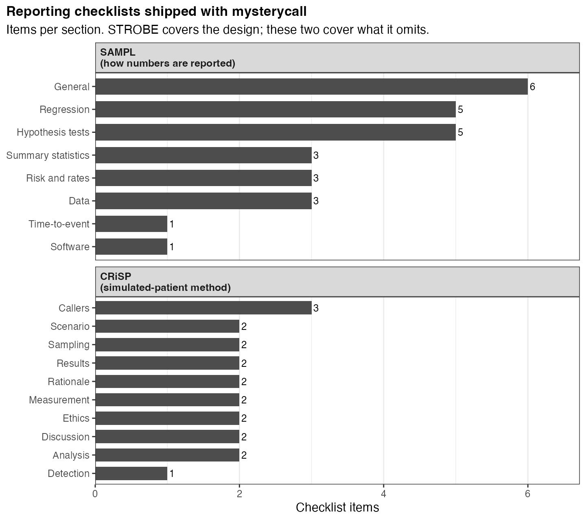

# mysterycall

<!-- badges: start -->


[](https://www.repostatus.org/#active)
[](https://lifecycle.r-lib.org/articles/stages.html#stable)
[](https://cran.r-project.org/)
[](https://github.com/mufflyt/mysterycall/actions/workflows/R-CMD-check.yaml)
[](https://github.com/mufflyt/mysterycall/actions/workflows/pkgdown.yaml)
[](https://app.codecov.io/gh/mufflyt/mysterycall?branch=main)
[](https://opensource.org/licenses/MIT)
[](https://orcid.org/0000-0002-2044-1693)
[](https://github.com/mufflyt/mysterycall/commits/main)
[](https://github.com/mufflyt/mysterycall/issues)
[](https://mufflyt.github.io/mysterycall/)
<!-- badges: end -->

## Statement of Need

Measuring patient access to healthcare requires assembling a provider roster,
placing calls under a standardized script, recording wait times and refusal
rates, and then modelling disparities by insurance type, race, or geography.
Each step involves bespoke data-engineering work that research teams currently
solve ad hoc: custom scripts to loop around the NPI API's 1,200-record cap,
manual regular expressions to parse name fields, silent `dplyr::left_join()`
calls that multiply rows when a lookup table has duplicates, and hand-crafted
Poisson models that lack overdispersion diagnostics.

**mysterycall** consolidates this work into a single, tested, documented
pipeline. It provides taxonomy-based NPI search that bypasses the record cap,
NANP phone validation with state-geography checks, physician name parsing with
credential and surname disambiguation, safe join wrappers that enforce coverage
and uniqueness guarantees, Poisson mixed-effects modelling with IRR reporting,
and publication-ready table export (drive-time isochrones and mapping are
available through the companion `mysterymaps` package). The target users are clinical
researchers and health-services researchers who conduct mystery-caller or audit
studies and need reproducible, auditable workflows rather than one-off scripts.

## Installation

```r
# install.packages("pak")
pak::pkg_install("mufflyt/mysterycall")
```

The package loads quickly. Heavier modelling and Census packages are optional
and loaded only when first needed:

```r
install.packages("lme4")                               # mixed-effects models
install.packages("censusapi")                          # Census block-group data
```

## Quick start

A typical mystery caller study builds a provider roster, then analyzes the
call outcomes:

```r
library(mysterycall)
library(dplyr)

# ── 1. Build a provider roster ────────────────────────────────────────────────

# Search by taxonomy across all 50 states (bypasses the 1,200-record API cap)
all_states <- c(
  "AL","AK","AZ","AR","CA","CO","CT","DE","FL","GA","HI","ID","IL","IN",
  "IA","KS","KY","LA","ME","MD","MA","MI","MN","MS","MO","MT","NE","NV",
  "NH","NJ","NM","NY","NC","ND","OH","OK","OR","PA","RI","SC","SD","TN",
  "TX","UT","VT","VA","WA","WV","WI","WY"
)

gyn_onc <- mysterycall_search_taxonomy("Gynecologic Oncology", states = all_states)

# Validate NPI numbers before downstream lookups
gyn_onc_valid <- mysterycall_validate_npi(gyn_onc)

# Enrich with CMS Physician Compare demographics
gyn_onc_enriched <- mysterycall_get_clinician_data(gyn_onc_valid)

# ── 2. Analyze acceptance and wait-time disparities ───────────────────────────

# `calls` is your completed call log: one row per call to a provider in the
# roster above, with an `insurance` arm and recorded outcomes/wait times.

# Medicaid vs. private acceptance rate with Wilson CIs and a gap sentence
rates <- mysterycall_acceptance_rate_calc(calls, insurance_col = "insurance")
print(rates)

# Wait-time model: incidence rate ratios by insurance, clustered by practice
fit <- mysterycall_poisson_model(
  calls,
  outcome = "business_days_until_appointment",
  predictors = "insurance",
  random_intercept = "practice"
)
mysterycall_irr_plot(fit)
```

> **Geocoding, drive-time isochrones, and mapping now live in the companion
> [`mysterymaps`](https://github.com/mufflyt/mysterymaps) package**
> (`mysterymaps::mysterymaps_geocode()`,
> `mysterymaps::mysterymaps_isochrones_for_df()`,
> `mysterymaps::mysterymaps_map_base()`). `mysterycall` focuses on the
> mystery-caller study design, analysis, and manuscript outputs.

## Gallery

<table>
<tr>
<td width="50%">

**Provider roster** — subspecialist counts from the built-in `physicians` dataset
(`mysterycall_search_taxonomy`)


</td>
<td width="50%">

**Geographic distribution** — dot map of 4,659 OBGYN subspecialists across the US
(via the [`mysterymaps`](https://github.com/mufflyt/mysterymaps) package)


</td>
</tr>
<tr>
<td width="50%">

**Acceptance rates** — Medicaid vs. private insurance by subspecialty
(`mysterycall_plot_stacked_bar`)


</td>
<td width="50%">

**Insurance disparity** — Wilson 95% CIs by insurance type
(`mysterycall_disparities_table`)


</td>
</tr>
<tr>
<td width="50%">

**Choropleth map** — appointment acceptance rate by state
(via the [`mysterymaps`](https://github.com/mufflyt/mysterymaps) package)


</td>
<td width="50%">

**Wait-time distribution** — overlapping densities with group medians
(`mysterycall_plot_density`)


</td>
</tr>
<tr>
<td width="50%">

**IRR forest plot** — incidence rate ratios from a Poisson GLMM
(`mysterycall_irr_plot`)


</td>
<td width="50%">

**Power curve** — providers per arm needed to detect a given IRR
(`mysterycall_equation_figure`)


</td>
</tr>
<tr>
<td width="50%">

**CONSORT flowchart** — sequential inclusion/exclusion for audit studies
(`mysterycall_flowchart`)


</td>
<td width="50%">

**Residual diagnostics** — three-panel model check for Poisson GLMM fit
(`mysterycall_plot_residuals`)


</td>
</tr>
<tr>
<td width="50%">

**100% stacked bar** — acceptance vs. rejection proportions with call counts
(`mysterycall_plot_stacked_bar`)


</td>
<td width="50%">

**Estimated marginal means** — Medicaid vs. private wait days by subspecialty
(`mysterycall_plot_emmeans_interaction`)


</td>
</tr>
<tr>
<td width="50%">

**Jittered scatter** — raw wait-day observations by subspecialty
(`mysterycall_plot_scatter`)


</td>
<td width="50%">

**Wait-time histogram** — sqrt-scaled count distribution
(`mysterycall_plot_distribution`)


</td>
</tr>
</table>

## Statistical reporting

STROBE says what to report about a study's design. **SAMPL** (Statistical
Analyses and Methods in the Published Literature) says how to report the
numbers themselves. mysterycall follows it by default, so a methods section can
cite the guideline rather than restate it.



Every interval and p-value in the package goes through one of two formatters,
so the convention lives in one place instead of being retyped at each call
site:

```r
mysterycall_format_ci(1.05, 1.57)      #> "1.05 to 1.57"
mysterycall_format_ci(-0.45, -0.12)    #> "-0.45 to -0.12"
mysterycall_format_p(0.0004, name = "p")  #> "p < 0.001"
```

SAMPL asks that interval endpoints be separated with "to" rather than a dash.
That reads as typographic fussiness until an endpoint goes negative, where
`-0.45--0.12` is genuinely ambiguous and `-0.45 to -0.12` is not. Ratio
measures hide the problem because they cannot be negative; mixed-model betas
and risk differences do not.

House styles differ, so the separator is an argument rather than a constant,
following the pattern of `gtsummary`'s JAMA and Lancet journal themes:

```r
options(mysterycall.ci_sep = " - ")   # one setting, whole document
```

Three fillable checklists ship for the supplementary file, and they do not
overlap:

| Checklist | Covers | Items |
|---|---|---|
| `mysterycall_strobe_checklist()` | Observational design, auto-checked against a fitted model | 16 |
| `mysterycall_crisp_checklist()` | Simulated-patient method: caller training, detection, ethics of deception | 20 |
| `mysterycall_sampl_checklist()` | How the numbers themselves are reported | 27 |

See `vignette("reporting-conventions")` for the full appendix, including the
three places the package deliberately departs from SAMPL and why.

## How mysterycall compares to alternatives

| Capability | mysterycall | `npi` package | `humaniformat` | Manual `dplyr` |
|---|---|---|---|---|
| NPI search — state-looping to bypass 1,200-record cap | ✅ | ❌ | ❌ | ❌ |
| NANP phone validation + state-geography check | ✅ | ❌ | ❌ | ❌ |
| Physician name parsing with DO/Vietnamese disambiguation | ✅ | ❌ | Partial | ❌ |
| Safe joins with coverage enforcement | ✅ | ❌ | ❌ | ❌ |
| Drive-time isochrones + Census overlay (via companion `mysterymaps`) | ✅ | ❌ | ❌ | ❌ |
| Poisson GLMM with IRR reporting | ✅ | ❌ | ❌ | ❌ |
| Disparities table with Wilson CIs | ✅ | ❌ | ❌ | ❌ |
| Green Journal–compliant figure export | ✅ | ❌ | ❌ | ❌ |

`npi` and `humaniformat` are excellent single-purpose packages.
`mysterycall` integrates them into a validated, end-to-end study pipeline
with audit trails, coverage guards, and publication-ready output.

## Core functions

| Stage | Function | Description |
|---|---|---|
| **Find providers** | `mysterycall_search_taxonomy()` | NPI search by taxonomy; loops over states to bypass the 1,200-record cap |
| | `mysterycall_search_and_process_npi()` | NPI search by first/last name |
| | `mysterycall_validate_npi()` | Remove invalid NPI numbers before enrichment |
| | `mysterycall_get_clinician_data()` | Pull demographics from CMS Physician Compare |
| | `mysterycall_genderize()` | Estimate physician gender via the Genderize.io API |
| **Census** | `mysterycall_get_census_data()` | ACS block-group demographics by state FIPS |
| **Geospatial** | *(moved to [`mysterymaps`](https://github.com/mufflyt/mysterymaps))* | Geocoding, drive-time isochrones, isochrone/block-group overlap, and Leaflet/HRR maps |
| **Analysis** | `mysterycall_hurdle_wait()` | Two-part model: whether an appointment was offered, then the wait among offers |
| | `mysterycall_lmm()` | Mixed-effects wait-time model with practice/caller clustering |
| **Data integrity** | `mysterycall_guard_contaminated_wait()` | Refuse to analyse a wait column that has been fill-down contaminated |
| | `mysterycall_flag_exclusion_discrepancy()` | Find excluded calls that nonetheless carry a wait time |
| | `mysterycall_reconcile_inclusion()` | Crosswalk REDCap exclusion codes against label strings |
| | `mysterycall_flag_repeat_physicians()` | Detect duplicate-entry and repeat-call contamination |
| **Tables** | `mysterycall_table_overall()` | Table 1 summary (via `arsenal`) |
| | `mysterycall_table_percentages()` | Column-percentage tables |
| **Reporting** | `mysterycall_format_ci()` | Interval string with a settable separator (SAMPL: "to", not a dash) |
| | `mysterycall_format_p()` | Exact p-values, never "NS"; `name=` for prose |
| | `mysterycall_sampl_checklist()` | 27-item statistical-reporting checklist |
| | `mysterycall_crisp_checklist()` | 20-item simulated-patient methodology checklist |
| | `mysterycall_strobe_checklist()` | 16-item STROBE checklist, auto-checked against a model |

## Built-in datasets

| Dataset | Description |
|---|---|
| `taxonomy` | NUCC taxonomy codes (v23.1) for all OBGYN subspecialties |
| `acog_districts` | State → ACOG district + Census subregion crosswalk |
| `acgme` | All 318 ACGME-accredited OBGYN residency programs |
| `physicians` | Sample roster of 4,659 OBGYN subspecialists with coordinates |
| `fips` | State FIPS codes and abbreviations |
| `city_state_to_lat_long` | City/state → lat/lon lookup table |
| `acog_presidents` | Historical ACOG presidents data |
| `adi_zcta` | Area Deprivation Index by ZCTA (33,774 rows; mean 100, SD 20) |
| `svi_zcta` | CDC Social Vulnerability Index by ZCTA (33,774 rows) |
| `zcta_tract_xwalk` | ZCTA to census-tract crosswalk with land-area weights (168,048 rows) |
| `medicaid_expansion` | State ACA Medicaid-expansion status and adoption date (51 rows) |
| `medicaid_fee_index` | KFF state Medicaid-to-Medicare fee index (51 rows) |
| `kff_hhi` | KFF hospital-market concentration (HHI) by MSA (387 rows) |
| `healthgrades_ages` | Physician age/credential records scraped from Healthgrades (88,416 rows) |

```r
# Example: find all OBGYN taxonomy codes
library(mysterycall)
library(dplyr)
library(stringr)

taxonomy |>
  filter(str_detect(Classification, fixed("GYN", ignore_case = TRUE))) |>
  select(Code, Specialization)
#> # A tibble: 11 × 2
#>    Code       Specialization
#>    <chr>      <chr>
#>  1 207V00000X Obstetrics & Gynecology
#>  2 207VF0040X Female Pelvic Medicine and Reconstructive Surgery
#>  3 207VX0201X Gynecologic Oncology
#>  4 207VM0101X Maternal & Fetal Medicine
#>  5 207VE0102X Reproductive Endocrinology
#>  ...
```

## Learn more

Full documentation, function reference, and worked vignettes:
**<https://mufflyt.github.io/mysterycall/>**

**Getting started**
- [Searching the NPI Database by Taxonomy](https://mufflyt.github.io/mysterycall/articles/my-vignette.html)
- [Search & Process NPI](https://mufflyt.github.io/mysterycall/articles/search_and_process_npi.html)
- [Workflow Orchestration](https://mufflyt.github.io/mysterycall/articles/workflow-orchestration.html)

**Data quality**
- [Phone Validation, Name Parsing, and Safe Joins](https://mufflyt.github.io/mysterycall/articles/data-quality.html)

**Analysis and reporting**
- [Statistical Analysis (Poisson GLMMs, disparities, bootstrap CIs)](https://mufflyt.github.io/mysterycall/articles/statistical-analysis.html)
- [Provider Classification (RUCA, practice setting, census region)](https://mufflyt.github.io/mysterycall/articles/provider-classification.html)
- [Table Generation](https://mufflyt.github.io/mysterycall/articles/table-generation.html)
- [Appendix: Statistical Reporting Conventions (SAMPL)](https://mufflyt.github.io/mysterycall/articles/reporting-conventions.html)
- [Get Census Data](https://mufflyt.github.io/mysterycall/articles/get_census_data.html)

## Citing mysterycall

```r
citation("mysterycall")
```

> Muffly, T. (2026). *mysterycall: Mystery Caller Study Tools for Healthcare
> Access Research* (R package version 1.6.3.9000).
> <https://github.com/mufflyt/mysterycall>

## Contributing

Contributions are welcome. New to the codebase? Start with
[ARCHITECTURE.md](ARCHITECTURE.md) — a map of how the package is organized (the
two-phase collection → analysis pipeline, the subsystem families, and the
project-specific conventions). Then read [CONTRIBUTING.md](CONTRIBUTING.md) for
the development workflow, coding style, and pull-request process. Bug reports
and feature requests are best filed as
[GitHub issues](https://github.com/mufflyt/mysterycall/issues).

## Code of conduct

Please note that this project is released with a
[Contributor Code of Conduct](CODE_OF_CONDUCT.md). By participating you agree
to abide by its terms.

## License

MIT © Tyler Muffly. See [LICENSE.md](LICENSE.md) for the full text.
