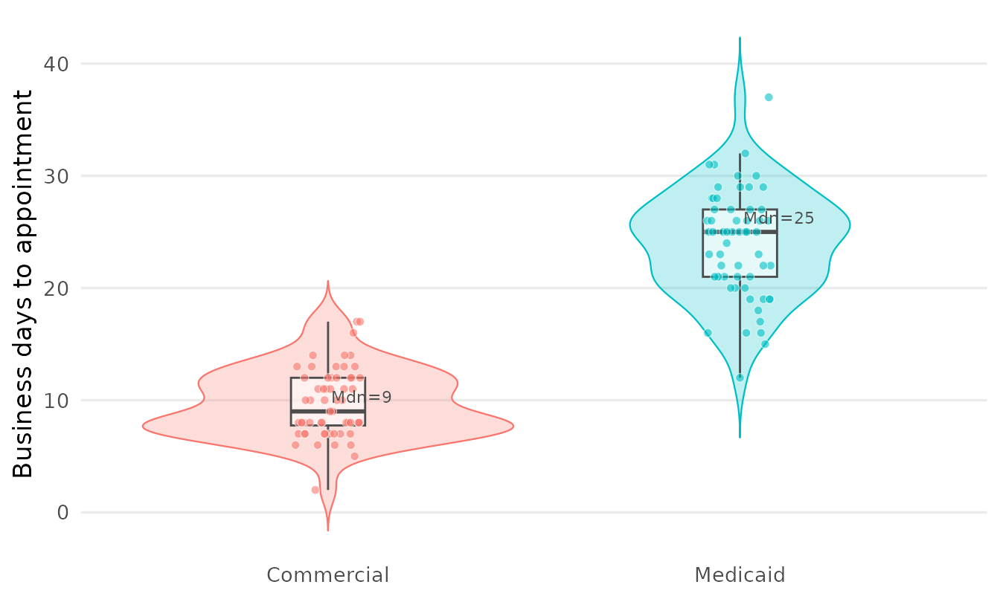
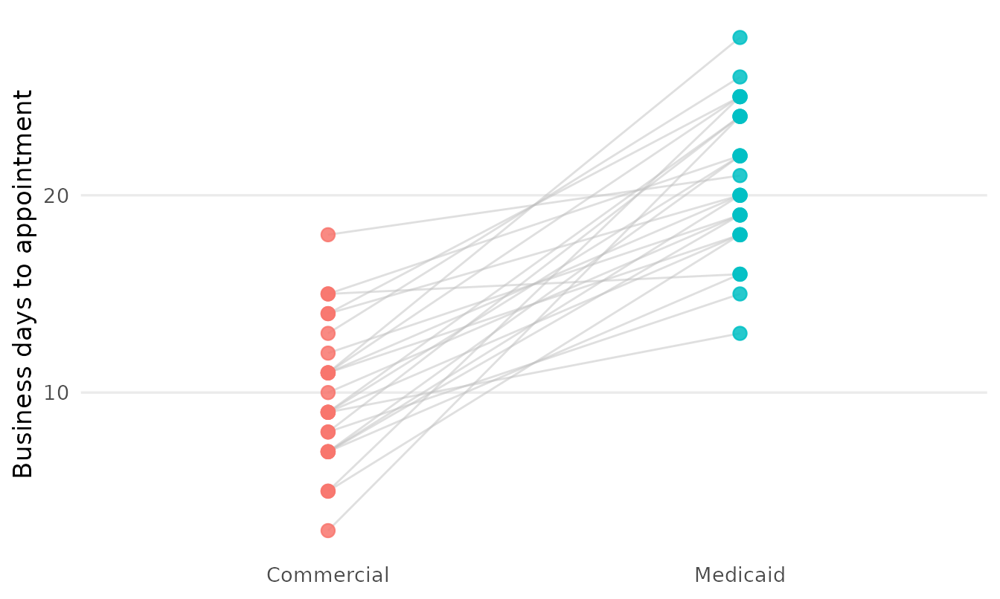

# Design, power, and cleaning tools from three audit studies

Three real mystery-caller studies each hand-rolled analysis code that
belonged in the package. This vignette walks the tools generalized from
them, grouped by where they came from:

- a **matched-pair** audit (the same practice called under several
  caller personas) — design-integrity checks, a population-average
  sensitivity model, and two paired figures;
- an **ENT geographic-access power** study — power calculators the
  package’s count/paired tools did not cover;
- the original **urogynecology** study — raw-field cleaning for messy
  call logs.

``` r

library(mysterycall)
```

## 1. Design integrity for a matched multi-scenario audit

A matched design only draws information from practices reached under
*both* arms of a contrast, so before analysing anything it is worth
knowing how complete the design actually is — and whether a mistyped
practice name has quietly split one practice into two.

``` r

set.seed(1)
practices <- sprintf("Practice %02d", 1:12)
calls <- do.call(rbind, lapply(seq_along(practices), function(i) {
  scen <- switch(as.character(i %% 3 + 1),
    "1" = c("Straight couple", "Lesbian couple", "Single mother"),
    "2" = c("Straight couple", "Lesbian couple"),
    "3" = "Straight couple")
  data.frame(practice = practices[i], scenario = scen)
}))
head(calls)
#>      practice        scenario
#> 1 Practice 01 Straight couple
#> 2 Practice 01  Lesbian couple
#> 3 Practice 02 Straight couple
#> 4 Practice 03 Straight couple
#> 5 Practice 03  Lesbian couple
#> 6 Practice 03   Single mother
```

[`mysterycall_scenario_coverage()`](https://mufflyt.github.io/mysterycall/reference/mysterycall_scenario_coverage.md)
reports, per practice, which scenarios were observed, and rolls that up
into complete / partial / singleton counts plus a missing-per-scenario
tally.

``` r

cov <- mysterycall_scenario_coverage(calls, "practice", "scenario")
cov
#> Scenario coverage across 12 clusters
#>   complete (all 3 scenarios): 4
#>   partial (2+ but not all):    4
#>   singleton (1 scenario):      4
#>   missing Lesbian couple:      4
#>   missing Single mother:       8
#>   missing Straight couple:     0
head(as.data.frame(cov))
#>            id has_Lesbian couple has_Single mother has_Straight couple
#> 1 Practice 01               TRUE             FALSE                TRUE
#> 2 Practice 02              FALSE             FALSE                TRUE
#> 3 Practice 03               TRUE              TRUE                TRUE
#> 4 Practice 04               TRUE             FALSE                TRUE
#> 5 Practice 05              FALSE             FALSE                TRUE
#> 6 Practice 06               TRUE              TRUE                TRUE
#>   n_scenarios
#> 1           2
#> 2           1
#> 3           3
#> 4           2
#> 5           1
#> 6           3
```

A one-character typo in a practice name deflates that count by turning
one practice into two singletons.
[`mysterycall_flag_near_duplicate_keys()`](https://mufflyt.github.io/mysterycall/reference/mysterycall_flag_near_duplicate_keys.md)
scans the keys with an edit distance and surfaces the suspicious pairs
for review.

``` r

keys <- c(practices, "Practice 01 ", "practice 02")  # a trailing space + a case slip
mysterycall_flag_near_duplicate_keys(keys)
#> # A tibble: 91 × 4
#>    key_a       key_b          edit_distance norm_distance
#>    <chr>       <chr>                  <int>         <dbl>
#>  1 Practice 02 "practice 02"              0         0    
#>  2 Practice 01 "Practice 01 "             1         0.083
#>  3 Practice 01 "Practice 02"              1         0.091
#>  4 Practice 01 "Practice 03"              1         0.091
#>  5 Practice 01 "Practice 04"              1         0.091
#>  6 Practice 01 "Practice 05"              1         0.091
#>  7 Practice 01 "Practice 06"              1         0.091
#>  8 Practice 01 "Practice 07"              1         0.091
#>  9 Practice 01 "Practice 08"              1         0.091
#> 10 Practice 01 "Practice 09"              1         0.091
#> # ℹ 81 more rows
```

## 2. A population-average sensitivity model

The subject-specific GLMM
([`mysterycall_logistic_model()`](https://mufflyt.github.io/mysterycall/reference/mysterycall_logistic_model.md))
estimates a *within-practice* effect and needs each practice’s random
intercept to be estimable.
[`mysterycall_gee()`](https://mufflyt.github.io/mysterycall/reference/mysterycall_gee.md)
fits the *population-average* companion with a generalized estimating
equation: it uses every call — including the singleton and dyad
practices a matched analysis drops — and reports robust,
correlation-insensitive odds ratios. Agreement between the two is a
standard sensitivity check.

``` r

set.seed(2)
np <- 60L
gee_dat <- data.frame(
  practice = rep(seq_len(np), each = 2),
  scenario = rep(c("Straight couple", "Lesbian couple"), np),
  accepted = rbinom(2 * np, 1, rep(c(0.82, 0.55), np))
)
mysterycall_gee(gee_dat, "accepted", "scenario", "practice",
                reference = c(scenario = "Straight couple"))
#> Population-average GEE (binomial/logit, exchangeable)  n = 120  clusters = 60
#>                    term    OR             CI       p
#>             (Intercept) 2.750 [1.552, 4.873] 0.00053
#>  scenarioLesbian couple 0.509 [0.225, 1.151] 0.10500
```

## 3. Two matched-pair figures

[`mysterycall_plot_raincloud()`](https://mufflyt.github.io/mysterycall/reference/mysterycall_plot_raincloud.md)
shows the full outcome distribution by group — violin, box, and every
raw point — the canonical way to present a skewed wait time without
hiding the sample size.

``` r

set.seed(3)
wait_dat <- data.frame(
  wait     = c(rpois(60, 10), rpois(60, 24)),
  scenario = rep(c("Commercial", "Medicaid"), each = 60)
)
mysterycall_plot_raincloud(wait_dat, "wait", "scenario",
                           y_lab = "Business days to appointment")
```



[`mysterycall_plot_paired_slope()`](https://mufflyt.github.io/mysterycall/reference/mysterycall_plot_paired_slope.md)
is the within-practice companion: one line per practice connecting its
calls across scenarios, showing the differencing the matched design
rests on.

``` r

set.seed(4)
pair_dat <- data.frame(
  practice = rep(1:25, each = 2),
  scenario = rep(c("Commercial", "Medicaid"), 25),
  wait     = c(rbind(rpois(25, 9), rpois(25, 20)))
)
mysterycall_plot_paired_slope(pair_dat, "wait", "scenario", "practice",
                              y_lab = "Business days to appointment")
```



## 4. Planning a study: power the count tools do not cover

The package already has power tools for paired, physician-clustered
count outcomes
([`mysterycall_marginal_power()`](https://mufflyt.github.io/mysterycall/reference/mysterycall_marginal_power.md),
[`mysterycall_twopart_power()`](https://mufflyt.github.io/mysterycall/reference/mysterycall_twopart_power.md),
[`mysterycall_nb_power()`](https://mufflyt.github.io/mysterycall/reference/mysterycall_nb_power.md)).
The ENT access study needed three that fall outside that: a
continuous-outcome calculator, factorial-term power, and covariate-
adjusted power with a higher-level cluster.

### 4a. Continuous outcome under a fixed natural allocation

When only a fraction of practices are rural, equal-allocation formulas
understate the sample size.
[`mysterycall_ttest_power()`](https://mufflyt.github.io/mysterycall/reference/mysterycall_ttest_power.md)
reports both the equal-allocation N and the total N under the study’s
real split.

``` r

mysterycall_ttest_power(mde = c(3, 5, 7), sd = 12, group_frac = 0.15)
#> # A tibble: 3 × 7
#>     mde cohens_d n_per_group_equal equal_total_n natural_n_small natural_n_large
#>   <dbl>    <dbl>             <dbl>         <dbl>           <dbl>           <dbl>
#> 1     3    0.25                253           506             148             840
#> 2     5    0.417                92           184              54             303
#> 3     7    0.583                48            96              28             156
#> # ℹ 1 more variable: natural_total_n <int>
```

### 4b. Factorial main effects and interactions

For a saturated `rural × subspecialty × insurance` model,
[`mysterycall_lm_interaction_power()`](https://mufflyt.github.io/mysterycall/reference/mysterycall_lm_interaction_power.md)
gives the N each term needs at small and medium effect sizes.

``` r

mysterycall_lm_interaction_power(
  terms = c("rural"                 = 1,
            "subspecialty"          = 6,
            "insurance"             = 1,
            "rural x subspecialty"  = 6,
            "rural x insurance"     = 1),
  n_params = 2 * 7 * 2
)
#> # A tibble: 5 × 4
#>   term                 df_num n_small n_medium
#>   <chr>                 <int>   <int>    <int>
#> 1 rural                     1     555      100
#> 2 subspecialty              6     900      145
#> 3 insurance                 1     555      100
#> 4 rural x subspecialty      6     900      145
#> 5 rural x insurance         1     555      100
```

### 4c. Covariate-adjusted power with a cluster ICC

[`mysterycall_adjusted_power()`](https://mufflyt.github.io/mysterycall/reference/mysterycall_adjusted_power.md)
simulates the *actual adjusted model* — a negative-binomial GLMM with a
rural fixed effect, a subspecialty effect, adjustment covariates, and a
state random intercept whose SD is derived from a target ICC — instead
of guessing a “+20% for clustering” inflation. (A small `n_sim` is used
here so the vignette builds quickly; use several hundred in practice.)

``` r

mysterycall_adjusted_power(
  n_total = 400, rural_frac = 0.15,
  wait_urban = 20, wait_rural = 28, phi = 1.7,
  state_icc = 0.05, n_sim = 20, seed = 1
)
#> # A tibble: 1 × 14
#>   n_total n_rural n_urban power mean_log_effect mean_se median_se
#>     <dbl>   <dbl>   <dbl> <dbl>           <dbl>   <dbl>     <dbl>
#> 1     400      60     340   0.8           0.343   0.122     0.123
#> # ℹ 7 more variables: convergence_rate <dbl>, state_icc <dbl>,
#> #   sigma_state <dbl>, n_states <dbl>, n_subspecs <dbl>, n_extra_covars <dbl>,
#> #   n_sim <dbl>
```

## 5. Cleaning raw call-log fields

The urogynecology study’s raw export had the messy free-text fields
every audit accumulates. These helpers replace the per-study lookup
tables that used to handle them.

[`mysterycall_parse_duration()`](https://mufflyt.github.io/mysterycall/reference/mysterycall_parse_duration.md)
turns hold-time / call-length free text into a numeric unit:

``` r

mysterycall_parse_duration(
  c("1.5min", "1min 45 sec", "30sec", "2.75min, 30sec", "O", "3"),
  output_unit = "seconds"
)
#> [1]  90 105  30 195   0 180
```

[`mysterycall_clean_zip()`](https://mufflyt.github.io/mysterycall/reference/mysterycall_clean_zip.md)
takes the first ZIP when several are present, strips a ZIP+4 suffix, and
restores the leading zero numeric parsing drops:

``` r

mysterycall_clean_zip(c("03110, 03756", 3110, "12345-6789", "no zip", NA))
#> [1] "03110" "03110" "12345" NA      NA
```

[`mysterycall_categorize_wait()`](https://mufflyt.github.io/mysterycall/reference/mysterycall_categorize_wait.md)
bins a days-to-appointment vector into weekly categories and the
headline “\>2-week wait” binary outcome:

``` r

mysterycall_categorize_wait(c(3, 10, 15, 30, NA), threshold_days = 14)
#> # A tibble: 5 × 3
#>    days bin   over_threshold
#>   <dbl> <ord> <lgl>         
#> 1     3 0-7   FALSE         
#> 2    10 8-14  FALSE         
#> 3    15 15-21 TRUE          
#> 4    30 > 28  TRUE          
#> 5    NA NA    NA
```

Finally,
[`mysterycall_link_physicians()`](https://mufflyt.github.io/mysterycall/reference/mysterycall_link_physicians.md)
reconciles two physician lists that share no NPI or other key, via
`fastLink` Jaro-Winkler name matching (with optional blocking on state),
returning matched pairs and their posterior match probability. The
example is shown but not run here.

``` r

roster_a <- data.frame(first_name = c("Katherine", "Robert"),
                       last_name  = c("Smith", "Jones"))
roster_b <- data.frame(first_name = c("Kathryn", "Bob"),
                       last_name  = c("Smith", "Jones"))
mysterycall_link_physicians(roster_a, roster_b,
                            c("first_name", "last_name"), threshold = 0.5)
```

## Summary

| Source study | Functions |
|----|----|
| Matched-pair audit | [`mysterycall_scenario_coverage()`](https://mufflyt.github.io/mysterycall/reference/mysterycall_scenario_coverage.md), [`mysterycall_flag_near_duplicate_keys()`](https://mufflyt.github.io/mysterycall/reference/mysterycall_flag_near_duplicate_keys.md), [`mysterycall_gee()`](https://mufflyt.github.io/mysterycall/reference/mysterycall_gee.md), [`mysterycall_plot_raincloud()`](https://mufflyt.github.io/mysterycall/reference/mysterycall_plot_raincloud.md), [`mysterycall_plot_paired_slope()`](https://mufflyt.github.io/mysterycall/reference/mysterycall_plot_paired_slope.md) |
| ENT access power | [`mysterycall_ttest_power()`](https://mufflyt.github.io/mysterycall/reference/mysterycall_ttest_power.md), [`mysterycall_lm_interaction_power()`](https://mufflyt.github.io/mysterycall/reference/mysterycall_lm_interaction_power.md), [`mysterycall_adjusted_power()`](https://mufflyt.github.io/mysterycall/reference/mysterycall_adjusted_power.md) |
| Urogynecology data prep | [`mysterycall_parse_duration()`](https://mufflyt.github.io/mysterycall/reference/mysterycall_parse_duration.md), [`mysterycall_clean_zip()`](https://mufflyt.github.io/mysterycall/reference/mysterycall_clean_zip.md), [`mysterycall_categorize_wait()`](https://mufflyt.github.io/mysterycall/reference/mysterycall_categorize_wait.md), [`mysterycall_link_physicians()`](https://mufflyt.github.io/mysterycall/reference/mysterycall_link_physicians.md) |
