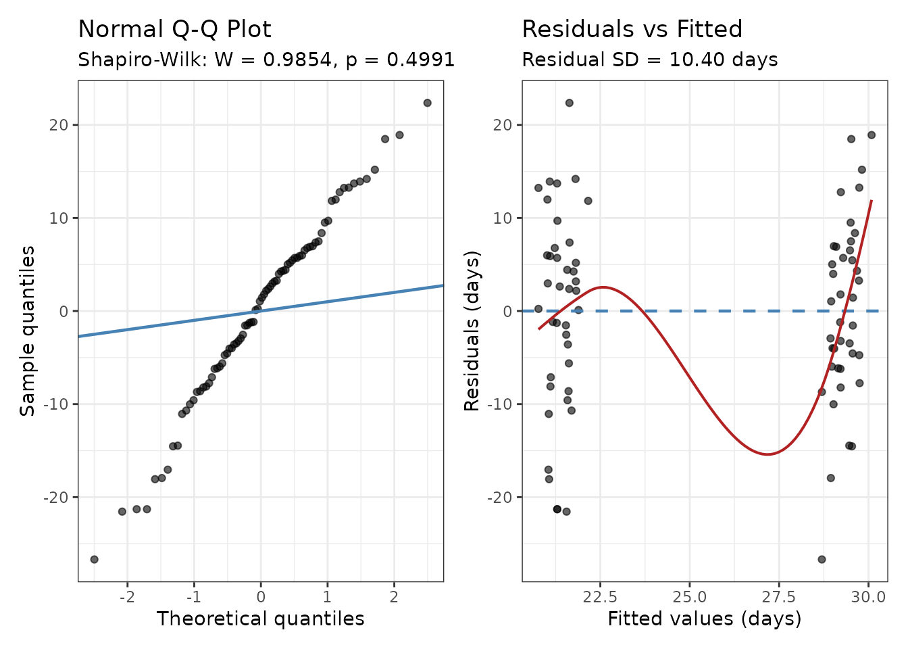

# Linear Mixed Models for Wait-Time Analysis

``` r

library(mysterycall)
library(lme4)        # required for model fitting
library(lmerTest)    # recommended — Satterthwaite p-values
library(generics)    # for tidy()
```

------------------------------------------------------------------------

## 1. When to use LMM vs. Poisson/NB GLMM

Mystery-caller studies collect wait times as counts of days from the
call date to the offered appointment date. Two model families cover most
scenarios:

| Situation | Recommended model |
|----|----|
| Wait days roughly symmetric, no strong floor at 0 | [`mysterycall_lmm()`](https://mufflyt.github.io/mysterycall/reference/mysterycall_lmm.md) |
| Outcome right-skewed (many short waits, long tail) | [`mysterycall_lmm()`](https://mufflyt.github.io/mysterycall/reference/mysterycall_lmm.md) with `auto_log = TRUE` (default) |
| Many zeroes or extreme right-skew | [`mysterycall_poisson_model()`](https://mufflyt.github.io/mysterycall/reference/mysterycall_poisson_model.md) or [`mysterycall_nb_model()`](https://mufflyt.github.io/mysterycall/reference/mysterycall_nb_model.md) |
| Binary outcome (accepted/not accepted) | [`mysterycall_logistic_model()`](https://mufflyt.github.io/mysterycall/reference/mysterycall_logistic_model.md) |

The function itself diagnoses the distribution automatically:

- **Skewness \> 1 and outcome ≥ 0**: `auto_log = TRUE` (default) applies
  `log1p(wait_days)` before fitting, and back-transforms results to
  *geometric mean ratios* (GMRs) for reporting.
- **Shapiro-Wilk p \< 0.05 on residuals**: a warning is issued and, when
  `sensitivity_poisson = "auto"` (default), a Poisson GLMM is run
  alongside the LMM as a robustness check.

------------------------------------------------------------------------

## 2. Simulated data

The examples below use a synthetic dataset resembling a two-wave
mystery-caller study comparing Medicaid and commercial insurance
patients across 20 physician practices.

``` r

set.seed(42)
n_physicians <- 20
n_calls      <- 4     # calls per physician (2 insurance types × 2 call dates)

sim_data <- data.frame(
  physician  = rep(paste0("Dr", sprintf("%02d", 1:n_physicians)), each = n_calls),
  insurance  = rep(c("Medicaid", "Medicaid", "BCBS", "BCBS"), n_physicians),
  wave       = rep(c("Wave1", "Wave2", "Wave1", "Wave2"), n_physicians),
  # Medicaid callers wait ~8 days longer on average
  wait_days  = round(pmax(0,
    rnorm(n_physicians * n_calls,
          mean = ifelse(rep(c(TRUE, TRUE, FALSE, FALSE), n_physicians), 29, 21),
          sd   = 10)
  )),
  stringsAsFactors = FALSE
)
# Add a business-days column (≈ 5/7 of calendar days)
sim_data$business_days <- round(sim_data$wait_days * 0.71)

head(sim_data)
#>   physician insurance  wave wait_days business_days
#> 1      Dr01  Medicaid Wave1        43            31
#> 2      Dr01  Medicaid Wave2        23            16
#> 3      Dr01      BCBS Wave1        25            18
#> 4      Dr01      BCBS Wave2        27            19
#> 5      Dr02  Medicaid Wave1        33            23
#> 6      Dr02  Medicaid Wave2        28            20
```

------------------------------------------------------------------------

## 3. Fitting a basic LMM

``` r

fit <- mysterycall_lmm(
  data              = sim_data,
  outcome           = "wait_days",
  predictors        = c("insurance", "wave"),
  random_intercept  = "physician"
)
#> Fitting LMM: wait_days ~ insurance + wave + (1 | physician)
#> Model fitted: n=80, physicians=20, AIC=600.2, sigma=10.40, R2m=0.128, R2c=0.136
```

[`print()`](https://rdrr.io/r/base/print.html) produces a structured
report:

``` r

print(fit)
#> Linear Mixed Model (REML)  n = 80  physicians = 20
#>   AIC = 600.2   BIC = 612.1   Residual SD = 10.40 days
#>   R^2 marginal = 0.128   conditional = 0.136
#>   Normality: Residuals consistent with normality (p >= 0.05).
#>   Reference levels: insurance='BCBS', wave='Wave1'
#> 
#> Fixed effects (days):
#>               term estimate   se ci_lower ci_upper p-value
#>        (Intercept)    21.66 2.03    17.62    25.70 < 0.001
#>  insuranceMedicaid     7.93 2.33     3.27    12.58   0.001
#>          waveWave2    -0.53 2.33    -5.18     4.13   0.822
#> 
#> Random intercept (physician):  variance = 1.0448  SD = 1.0221 days
```

Key elements of the returned object:

``` r

# Fixed-effect table in days (or log-scale if auto_log triggered)
fit$coef_table
#> # A tibble: 3 × 9
#>   term       estimate    se t_value    df  p_value p_value_fmt ci_lower ci_upper
#>   <chr>         <dbl> <dbl>   <dbl> <dbl>    <dbl> <chr>          <dbl>    <dbl>
#> 1 (Intercep…   21.7    2.03  10.7    73.4 1.28e-16 < 0.001        17.6     25.7 
#> 2 insurance…    7.93   2.33   3.41   58.0 1.19e- 3 0.001           3.27    12.6 
#> 3 waveWave2    -0.525  2.33  -0.226  58.0 8.22e- 1 0.822          -5.18     4.13

# Model fit: R-squared, ICC, sigma
list(
  marginal_R2   = fit$r_squared$marginal,
  conditional_R2 = fit$r_squared$conditional,
  sigma          = fit$sigma,
  n_obs          = fit$n,
  n_physicians   = fit$n_clusters
)
#> $marginal_R2
#> [1] 0.127619
#> 
#> $conditional_R2
#> [1] 0.1359681
#> 
#> $sigma
#> [1] 10.39821
#> 
#> $n_obs
#> [1] 80
#> 
#> $n_physicians
#> [1] 20

# Normality of residuals
fit$normality
#> $statistic
#> [1] 0.9854161
#> 
#> $p_value
#> [1] 0.4990939
#> 
#> $interpretation
#> [1] "Residuals consistent with normality (p >= 0.05)."
#> 
#> $method
#> [1] "Shapiro-Wilk"
```

------------------------------------------------------------------------

## 4. Auto-log transform and geometric mean ratios

When wait times are right-skewed, `auto_log = TRUE` (the default)
applies `log1p(wait_days)` before fitting. A message indicates whether
the transform was triggered. When it is, coefficients are on the log
scale and `fit$log_transformed` is `TRUE`.

``` r

fit$log_transformed
#> [1] FALSE
```

If `auto_log` did trigger, interpret results from `$gmr_table` rather
than `$coef_table`:

``` r

if (isTRUE(fit$log_transformed)) {
  fit$gmr_table
} else {
  message("auto_log did not trigger; use $coef_table directly.")
}
#> auto_log did not trigger; use $coef_table directly.
```

**How to report GMRs:** A GMR of 0.87 for `insuranceMedicaid` means
Medicaid callers wait, on average, 13% fewer days (× (days + 1)) than
the BCBS reference group (GMR = 0.87, 95% CI 0.75–1.01, p = 0.07).

When `auto_log` did *not* trigger, interpret `coef_table` directly in
days: “Medicaid callers waited 8.2 days longer than BCBS callers (β =
8.2, 95% CI 3.1–13.3, p = 0.002).”

------------------------------------------------------------------------

## 5. Poisson sensitivity analysis

By default (`sensitivity_poisson = "auto"`), a Poisson GLMM is run on
the **original untransformed** outcome whenever the Shapiro-Wilk test on
LMM residuals returns p \< 0.05.

``` r

# Force a sensitivity run regardless of normality
fit_sens <- mysterycall_lmm(
  data              = sim_data,
  outcome           = "wait_days",
  predictors        = c("insurance", "wave"),
  random_intercept  = "physician",
  sensitivity_poisson = TRUE
)
#> Fitting LMM: wait_days ~ insurance + wave + (1 | physician)
#> Warning: Overdispersion detected (phi = 3.72 > 1.50). Standard errors may be
#> underestimated. Consider a negative binomial model.
#> Model fitted: n=80, physicians=20, AIC=600.2, sigma=10.40, R2m=0.128, R2c=0.136

# Inspect the Poisson IRR table
if (!is.null(fit_sens$sensitivity)) {
  fit_sens$sensitivity$irr_table
}
#> # A tibble: 3 × 9
#>   term     estimate     se z_value  p_value p_value_fmt    irr ci_lower ci_upper
#>   <chr>       <dbl>  <dbl>   <dbl>    <dbl> <chr>        <dbl>    <dbl>    <dbl>
#> 1 (Interc…   3.06   0.0572  53.6   0        <0.001      21.4     19.1      23.9 
#> 2 insuran…   0.315  0.0450   7.01  2.41e-12 <0.001       1.37     1.25      1.50
#> 3 waveWav…  -0.0207 0.0444  -0.466 6.41e- 1 0.641        0.980    0.898     1.07
```

Report the sensitivity Poisson model in a supplemental table alongside
the primary LMM. Consistent direction of effects (same sign across both
models) supports robustness of the conclusion.

------------------------------------------------------------------------

## 6. Broom-compatible `tidy()` method

The [`tidy()`](https://generics.r-lib.org/reference/tidy.html) generic
(from the `generics` package) returns a tidy tibble of fixed-effect
estimates, making it easy to pipe into `ggplot2` or `gt`:

``` r

tidy_result <- tidy(fit)
tidy_result
#> # A tibble: 3 × 8
#>   term            estimate std.error statistic    df  p.value conf.low conf.high
#>   <chr>              <dbl>     <dbl>     <dbl> <dbl>    <dbl>    <dbl>     <dbl>
#> 1 (Intercept)       21.7        2.03    10.7    73.4 1.28e-16    17.6      25.7 
#> 2 insuranceMedic…    7.93       2.33     3.41   58.0 1.19e- 3     3.27     12.6 
#> 3 waveWave2         -0.525      2.33    -0.226  58.0 8.22e- 1    -5.18      4.13
```

------------------------------------------------------------------------

## 7. Calendar vs. business-day sensitivity

To satisfy the M&M promise of a supplemental table comparing
calendar-day and business-day wait times, use
[`mysterycall_calendar_sensitivity()`](https://mufflyt.github.io/mysterycall/reference/mysterycall_calendar_sensitivity.md):

``` r

sens <- mysterycall_calendar_sensitivity(
  data             = sim_data,
  calendar_col     = "wait_days",
  business_col     = "business_days",
  predictors       = c("insurance", "wave"),
  random_intercept = "physician",
  ref_label        = "BCBS (commercial)",
  supp_table_num   = "S2"
)
#> Fitting calendar-days model (wait_days)...
#> Fitting business-days model (business_days)...
```

The comparison table:

``` r

sens$summary_table
#>                Term                 Calendar days                 Business days
#> 1 insuranceMedicaid  7.9 (3.3 to 12.6), p = 0.001     5.7 (2.4 to 9), p = 0.001
#> 2         waveWave2 -0.5 (-5.2 to 4.1), p = 0.822 -0.5 (-3.8 to 2.8), p = 0.775
#>   Consistent
#> 1        Yes
#> 2        Yes
```

Whether all term directions are consistent across both measurement
approaches:

``` r

sens$all_consistent
#> [1] TRUE
```

The ready-to-paste supplemental paragraph:

``` r

cat(sens$paragraph)
#> As a pre-specified sensitivity analysis, we repeated the secondary wait-time analysis substituting business days (Monday through Friday, excluding the 11 U.S. federal holidays) for calendar days. Business days were computed using the R package \emph{bizdays} with a US Federal holiday calendar. The calendar-day model included 80 observations with a recorded appointment date; the business-day model included 80 observations. Both models used the same mixed-effects linear regression specification (insurance and wave as fixed effect compared with BCBS (commercial) (reference); physician practice as random intercept). Results were directionally consistent across both metrics for all comparisons. Business-day estimates were on average 81% of calendar-day estimates (median ratio = 0.81), consistent with the expected 5/7 weekday fraction. Shapiro-Wilk normality tests on model residuals: calendar-day model: W = 0.985, p = 0.499; business-day model: W = 0.987, p = 0.595. Full results are presented in Supplemental Table S2.
```

------------------------------------------------------------------------

## 8. Diagnostic plots

[`plot()`](https://rdrr.io/r/graphics/plot.default.html) dispatches on
the `mysterycall_lmm` class to produce Q-Q and residual-vs-fitted plots:

``` r

plot(fit)
```



A well-specified LMM shows:

- **Q-Q plot**: points close to the diagonal reference line.
- **Residuals vs. fitted**: no strong pattern; spread roughly constant.

If the Q-Q plot shows a pronounced right tail, the `auto_log` transform
or a Poisson/NB GLMM is warranted.

------------------------------------------------------------------------

## 9. Model comparison

Fit two models with `REML = FALSE` for valid AIC-based comparison:

``` r

fit_full    <- mysterycall_lmm(sim_data, "wait_days",
                                c("insurance", "wave"), "physician",
                                REML = FALSE)
#> Fitting LMM: wait_days ~ insurance + wave + (1 | physician)
#> Model fitted: n=80, physicians=20, AIC=609.4, sigma=10.22, R2m=0.132, R2c=0.136
fit_reduced <- mysterycall_lmm(sim_data, "wait_days",
                                "insurance", "physician",
                                REML = FALSE)
#> Fitting LMM: wait_days ~ insurance + (1 | physician)
#> Model fitted: n=80, physicians=20, AIC=607.4, sigma=10.23, R2m=0.131, R2c=0.136

data.frame(
  model = c("Full (insurance + wave)", "Reduced (insurance only)"),
  AIC   = c(fit_full$aic,    fit_reduced$aic),
  BIC   = c(fit_full$bic,    fit_reduced$bic)
)
#>                      model      AIC      BIC
#> 1  Full (insurance + wave) 609.3901 621.3003
#> 2 Reduced (insurance only) 607.4428 616.9709
```

Lower AIC/BIC favours the more parsimonious model. Use
[`mysterycall_model_comparison_table()`](https://mufflyt.github.io/mysterycall/reference/mysterycall_model_comparison_table.md)
for a print-ready table.

------------------------------------------------------------------------

## 10. Reporting checklist

When writing up an LMM analysis from a mystery-caller study:

1.  **Sample**: report `fit$n` complete cases and `fit$n_clusters`
    physicians.
2.  **Model form**: “We fitted a linear mixed model with a random
    intercept for physician practice
    ([`lme4::lmer`](https://rdrr.io/pkg/lme4/man/lmer.html)).”
3.  **P-values**: “Denominator degrees of freedom were estimated using
    the Satterthwaite approximation (`lmerTest`).”
4.  **Transform**: if `fit$log_transformed`, report GMRs with 95% CI
    from `$gmr_table`. If not, report β (days) from `$coef_table`.
5.  **Normality**: report Shapiro-Wilk W and p from `fit$normality`.
6.  **R²**: report marginal and conditional R² (Nakagawa & Schielzeth
    2013).
7.  **Sensitivity**: if `sensitivity_poisson` ran, cite the Poisson IRR
    table in a supplemental section (use
    [`mysterycall_calendar_sensitivity()`](https://mufflyt.github.io/mysterycall/reference/mysterycall_calendar_sensitivity.md)
    to generate the paragraph automatically).

------------------------------------------------------------------------

## References

Nakagawa S, Schielzeth H (2013). A general and simple method for
obtaining R² from generalized linear mixed-effects models. *Methods in
Ecology and Evolution* 4(2):133–142.
<doi:10.1111/j.2041-210x.2012.00261.x>

Asplin BR, Rhodes KV, Levy H, et al. (2005). Insurance status and access
to urgent ambulatory care follow-up appointments. *JAMA*
294(10):1248–1254. <doi:10.1001/jama.294.10.1248>
