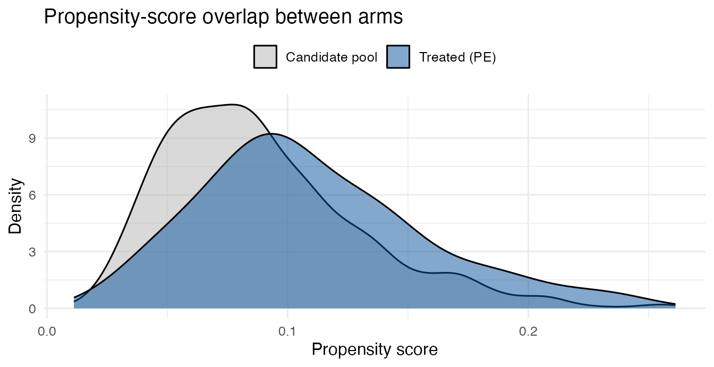

# Designing a matched-control mystery-caller audit

Some mystery-caller studies are **case–control** by design: a treated
group of practices — private-equity-owned, hospital-acquired, or a
specific chain — is compared against otherwise-similar practices. Two
problems have to be solved *before* any calls are placed:

1.  **Fairness.** Treated and control practices differ on things other
    than the exposure (physician age, degree, gender, local market). If
    controls are drawn at random, an apparent access difference may just
    reflect those imbalances.
2.  **Feasibility.** Callers can only place so many calls, and a control
    is only useful if it is genuinely *callable* — ideally in the same
    state and a short drive from its treated counterpart, so the two
    share a labor market and payer
    1009. 

Matching each treated practice to a nearby, comparable control addresses
both. This vignette walks that design end to end — geocoding a roster,
building a propensity-score-matched control cohort inside a geographic
caliper, assembling the paired calling list, and analysing the completed
audit — motivated by a study of private-equity ownership of OB/GYN
practices. (Deriving the treated cohort itself — tying practice names
back to an ownership reference — is an upstream step outside the
package.)

``` r
library(mysterycall)
```

## 1. The treated cohort and a candidate pool

We simulate 60 private-equity-owned (“treated”) practices concentrated
in three metros, plus a large pool of independent candidate controls in
the same metros. Each practice carries the covariates we want to balance
— years in practice, physician gender, and degree (MD vs DO) — and a
city/state. The treated practices are drawn slightly younger and more
often DO-led, so the arms are *not* balanced to begin with.

``` r
set.seed(2026)
metros <- list(
  CO = c("Denver", "Aurora", "Lakewood"),
  TX = c("Dallas", "Irving", "Plano"),
  FL = c("Miami", "Hialeah", "Miami Beach")
)
draw <- function(n, treated) {
  st <- sample(names(metros), n, TRUE)
  data.frame(
    npi   = NA_integer_,
    state = st,
    city  = vapply(st, function(s) sample(metros[[s]], 1), character(1)),
    years = round(rpois(n, if (treated) 11 else 12)),
    female = rbinom(n, 1, if (treated) 0.45 else 0.55),
    md = rbinom(n, 1, if (treated) 0.72 else 0.82),
    stringsAsFactors = FALSE
  )
}
treated    <- draw(60, TRUE);   treated$npi    <- 1:60
candidates <- draw(600, FALSE); candidates$npi <- 1001:1600
head(treated)
#>   npi state     city years female md
#> 1   1    CO   Denver     6      0  1
#> 2   2    CO Lakewood     5      1  0
#> 3   3    CO Lakewood     6      0  0
#> 4   4    TX   Dallas    10      1  1
#> 5   5    CO   Aurora     8      1  0
#> 6   6    FL    Miami    16      1  0
```

## 2. Aligning rosters by name

Before matching, you often have to reconcile two rosters that spell the
same practice differently — the ownership list that defines “treated”,
and the NPPES or CMS roster the candidate pool comes from. Exact joins
fail on `LLC` vs `PC`, `&` vs `and`, and stray punctuation.
[`mysterycall_normalize_org_name()`](https://mufflyt.github.io/mysterycall/reference/mysterycall_normalize_org_name.md)
collapses those variants to a single canonical key:

``` r
messy <- c("Women's Health Specialists, LLC", "Womens Health Specialists PC",
           "Rocky Mountain OB & GYN, P.A.")
mysterycall_normalize_org_name(messy)
#> [1] "WOMENS HEALTH SPECIALISTS" "WOMENS HEALTH SPECIALISTS"
#> [3] "ROCKY MOUNTAIN OB AND GYN"
```

In practice you would add the key to both frames and merge on it:

``` r
cohort <- data.frame(name = messy)
roster <- data.frame(name = c("WOMENS HEALTH SPECIALISTS", "ROCKY MOUNTAIN OB AND GYN"),
                     owner = c("PE-backed", "Independent"))
cohort$key <- mysterycall_normalize_org_name(cohort$name)
merge(cohort, roster, by.x = "key", by.y = "name")
#>                         key                            name       owner
#> 1 ROCKY MOUNTAIN OB AND GYN   Rocky Mountain OB & GYN, P.A. Independent
#> 2 WOMENS HEALTH SPECIALISTS Women's Health Specialists, LLC   PE-backed
#> 3 WOMENS HEALTH SPECIALISTS    Womens Health Specialists PC   PE-backed
```

## 3. Geocode from city + state

A geographic caliper needs coordinates, but the roster only has a city
and a state.
[`mysterycall_geocode_city_state()`](https://mufflyt.github.io/mysterycall/reference/mysterycall_geocode_city_state.md)
looks them up in the bundled place table (~32,000 US places) — no
network, no API key — enough to seed a caliper or QC how far apart
matched practices sit. For rooftop-accurate coordinates from full street
addresses, use a dedicated geocoding service instead.

``` r
tg <- mysterycall_geocode_city_state(treated$city, treated$state)
treated$lat <- tg$lat; treated$lon <- tg$lon
cg <- mysterycall_geocode_city_state(candidates$city, candidates$state)
candidates$lat <- cg$lat; candidates$lon <- cg$lon
c(treated_resolved = mean(!is.na(treated$lat)),
  candidate_resolved = mean(!is.na(candidates$lat)))
#>   treated_resolved candidate_resolved 
#>                  1                  1
```

Places the bundled table misses (townships, renamed municipalities) can
be supplied through the `overrides` argument rather than dropped.

## 4. The propensity model and common support

Matching rests on the **propensity score** — the modeled probability of
being treated given the covariates.
[`mysterycall_build_matched_controls()`](https://mufflyt.github.io/mysterycall/reference/mysterycall_build_matched_controls.md)
fits it internally, but it is worth inspecting. Here is the same model,
fit directly:

``` r
ps_df <- rbind(cbind(treatment = 1, treated[, c("years", "female", "md")]),
               cbind(treatment = 0, candidates[, c("years", "female", "md")]))
ps_fit <- glm(treatment ~ years + female + md, binomial, ps_df)
round(coef(summary(ps_fit)), 3)
#>             Estimate Std. Error z value Pr(>|z|)
#> (Intercept)   -0.420      0.528  -0.796    0.426
#> years         -0.132      0.043  -3.086    0.002
#> female        -0.397      0.274  -1.447    0.148
#> md            -0.223      0.323  -0.689    0.491
```

Matching only works where treated and control scores **overlap** (the
common-support assumption). A treated practice with a score no control
comes close to has no honest match. Compare the two score distributions:

``` r
treated$ps    <- predict(ps_fit, treated, type = "response")
candidates$ps <- predict(ps_fit, candidates, type = "response")
library(ggplot2)
ggplot(mapping = aes(x = ps)) +
  geom_density(data = candidates, aes(fill = "Candidate pool"), alpha = 0.5) +
  geom_density(data = treated, aes(fill = "Treated (PE)"), alpha = 0.5) +
  scale_fill_manual(NULL, values = c("Candidate pool" = "grey70",
                                     "Treated (PE)" = "#08519c")) +
  labs(x = "Propensity score", y = "Density",
       title = "Propensity-score overlap between arms") +
  theme_minimal(base_size = 12) + theme(legend.position = "top")
```



Good overlap here: every treated score is well inside the candidate
range.

## 5. Build the matched control cohort

Now the match itself.
[`mysterycall_build_matched_controls()`](https://mufflyt.github.io/mysterycall/reference/mysterycall_build_matched_controls.md)
fits the propensity model, then greedily matches each treated practice
1:1 to its nearest control on the propensity score — within the **same
state** and a **25-mile** caliper, **without replacement** (each control
is used at most once). The greedy scheme, with a hard state + distance
constraint, is what makes every control genuinely callable.

``` r
m <- mysterycall_build_matched_controls(
  treated, candidates,
  ps_formula    = treatment ~ years + female + md,
  id_col        = "npi",
  exact         = "state",
  coords        = c("lat", "lon"),
  caliper_miles = 25
)
m
#> <mysterycall matched controls: 60 of 60 treated matched (0 unmatched)>
#>   median control distance: 9.6 miles; max ps difference: 0.030
#> 
#> Covariate balance (standardized mean differences):
#> # A tibble: 3 × 4
#>   covariate mean_treated mean_control     smd
#>   <chr>            <dbl>        <dbl>   <dbl>
#> 1 years           10.6          10.6   0     
#> 2 female           0.483         0.5  -0.0331
#> 3 md               0.75          0.75  0
```

``` r
head(m$pairs)
#> # A tibble: 6 × 7
#>   pair_id treated_id control_id ps_treated ps_control   ps_diff distance_miles
#>     <int>      <int>      <int>      <dbl>      <dbl>     <dbl>          <dbl>
#> 1       1          1       1469     0.192      0.186  0.00644            11.4 
#> 2       2          2       1598     0.186      0.186  0.0000767          13.3 
#> 3       3          3       1245     0.229      0.206  0.0225             13.3 
#> 4       4          4       1017     0.0860     0.0860 0                   0   
#> 5       5          5       1356     0.133      0.133  0                   0   
#> 6       6          6       1508     0.0505     0.0505 0.0000243           4.45
```

## 6. Did matching work? Balance before and after

The point of matching is to erase the covariate imbalance we built in.
Compare the standardized mean difference (SMD) of each covariate
**before** matching (treated vs. the whole candidate pool) and **after**
(treated vs. matched controls). An SMD below about 0.1 is the usual
“well-balanced” rule of thumb.

``` r
smd <- function(a, b) {
  (mean(a) - mean(b)) / sqrt((var(a) + var(b)) / 2)
}
before <- vapply(c("years", "female", "md"),
                 function(v) smd(treated[[v]], candidates[[v]]), numeric(1))
after  <- setNames(m$balance$smd, m$balance$covariate)
round(data.frame(before_matching = before, after_matching = after[names(before)]), 3)
#>        before_matching after_matching
#> years           -0.451          0.000
#> female          -0.190         -0.033
#> md              -0.153          0.000
```

Every covariate moves toward zero after matching.

## 7. How tight a caliper? A sensitivity sweep

The caliper trades geographic closeness against how many treated
practices find a match. Tighten it and controls are nearer but more
treated practices go unmatched. Sweep a few values:

``` r
sweep <- sapply(c(5, 10, 25, 50, 100), function(cm) {
  mm <- mysterycall_build_matched_controls(
    treated, candidates, treatment ~ years + female + md,
    id_col = "npi", exact = "state", coords = c("lat", "lon"),
    caliper_miles = cm)
  c(caliper_miles = cm, matched = mm$n_matched,
    median_dist = round(stats::median(mm$pairs$distance_miles, na.rm = TRUE), 1))
})
t(sweep)
#>      caliper_miles matched median_dist
#> [1,]             5      60         0.0
#> [2,]            10      60         0.0
#> [3,]            25      60         9.6
#> [4,]            50      60         9.6
#> [5,]           100      60         9.6
```

Report the caliper you chose and this trade-off in the methods; it is a
reviewer’s first question.

## 8. The matched calling list

Stack the two arms into one long calling list, tagged by matched pair —
what the callers work from.
([`mysterycall_export_gsheet_caller_list()`](https://mufflyt.github.io/mysterycall/reference/mysterycall_export_gsheet_caller_list.md)
writes this out in a Google-Sheets-ready format.)

``` r
pe   <- m$matched_treated;  pe$arm   <- "PE";      pe$pair_id   <- m$pairs$pair_id
ctl  <- m$matched_controls; ctl$arm  <- "Control"; ctl$pair_id  <- m$pairs$pair_id
cols <- c("npi", "state", "arm", "pair_id")
call_list <- rbind(pe[, cols], ctl[, cols])
table(call_list$arm)
#> 
#> Control      PE 
#>      60      60
```

## 9. Analyse the paired audit

Suppose the calls are complete. We simulate an offer and a wait time for
each practice, with PE practices a little less likely to accept and a
little slower:

``` r
is_pe <- call_list$arm == "PE"
call_list$accepted  <- rbinom(nrow(call_list), 1, ifelse(is_pe, 0.62, 0.78))
call_list$wait_days <- ifelse(
  call_list$accepted == 1,
  rnbinom(nrow(call_list), mu = ifelse(is_pe, 24, 18), size = 3), NA)
```

Because the design is matched, the comparison is *within pair*, and only
the **discordant** pairs (one arm accepted, the other did not) carry
information about the exposure. The same within-cluster tools used for
insurance-scenario studies apply, with the matched pair as the unit and
the arm as the “scenario”. Acceptance, via the exact McNemar test:

``` r
mysterycall_paired_acceptance_mcnemar(
  call_list, id_col = "pair_id", scenario_col = "arm", outcome_col = "accepted")
#> <mysterycall paired McNemar: 1 contrast(s), MDE at 80% power>
#> # A tibble: 1 × 9
#>   contrast   n_paired concordant discordant disc_favor_a disc_favor_b odds_ratio
#>   <chr>         <int>      <int>      <int>        <int>        <int>      <dbl>
#> 1 PE vs Con…       60         30         30            5           25        0.2
#> # ℹ 2 more variables: mcnemar_p <dbl>, mde_or_power <dbl>
```

The `discordant`, `disc_favor_a`/`disc_favor_b`, and `odds_ratio`
columns show how many pairs split each way and the direction of the
effect; `mde_or_power` is the smallest odds ratio this many discordant
pairs could detect. Wait time, via the within-pair paired comparison
(mean difference with a paired-t CI, plus the Wilcoxon signed-rank
p-value):

``` r
mysterycall_paired_wait_within_practice(
  call_list, id_col = "pair_id", scenario_col = "arm", wait_col = "wait_days")
#> <mysterycall paired wait: 1 contrast(s), MDE at 80% power>
#> # A tibble: 1 × 9
#>   contrast      n_paired mean_diff_days ci_lower ci_upper sd_diff paired_t_p
#>   <chr>            <int>          <dbl>    <dbl>    <dbl>   <dbl>      <dbl>
#> 1 PE vs Control       26         -0.731    -6.80     5.34    15.0      0.806
#> # ℹ 2 more variables: wilcoxon_p <dbl>, mde_days_power <dbl>
```

## 10. Power for the next matched study

Sizing a follow-up uses the two-part power tools, treating the arm as
the exposure — a binary offer on every call plus a wait time only among
offers:

``` r
mysterycall_twopart_power(
  n_total = c(120, 200), offer_ref = 0.78, offer_trt = 0.62,
  wait_ref = 18, wait_trt = 24, phi = 3, n_sim = 50, seed = 1)
#> <mysterycall two-part power: 2 sample size(s), 50 sims, alpha 0.050>
#> # A tibble: 2 × 8
#>   n_total n_ref n_trt pow_offer pow_wait mean_offered convergence_rate n_sim
#>     <dbl> <dbl> <dbl>     <dbl>    <dbl>        <dbl>            <dbl> <dbl>
#> 1     120    60    60      0.38     0.6          84.6                1    50
#> 2     200   100   100      0.76     0.88        140.                 1    50
```

## Assumptions and limitations

- **Matching balances only *observed* covariates.** Unmeasured
  differences between PE-owned and independent practices can still
  confound the comparison; matching is not randomization.
- **Greedy, not optimal.** Matches are made one treated unit at a time
  in a fixed order, so the total distance is not globally minimized. For
  this design — where a callable, in-caliper control matters more than
  the global optimum — greedy is the right trade-off; when it is not, an
  optimal matcher (e.g. the package) is the alternative.
- **City-level geocoding.**
  [`mysterycall_geocode_city_state()`](https://mufflyt.github.io/mysterycall/reference/mysterycall_geocode_city_state.md)
  places every practice at its city centroid, so within-city pairs read
  as zero miles apart. That is fine for a coarse caliper; a study
  reporting exact separations should geocode full street addresses.
- **Report the unmatched.** Treated practices with no in-caliper control
  are dropped from the analysis; state how many (`m$n_unmatched`) and
  whether they differ systematically, since that shapes who the study
  generalizes to.

## Recap

From a treated cohort and a candidate pool to a fair, callable
comparison and its analysis: reconcile rosters by normalized name,
geocode, check propensity-score overlap, build a matched control group
inside a geographic caliper, confirm balance improved, choose the
caliper deliberately, assemble the paired calling list, and analyse the
completed audit with the matched McNemar and paired-wait tests — then
power the next one.
