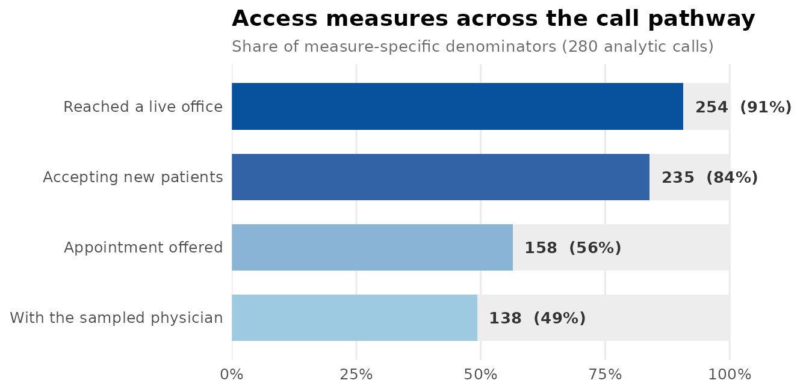
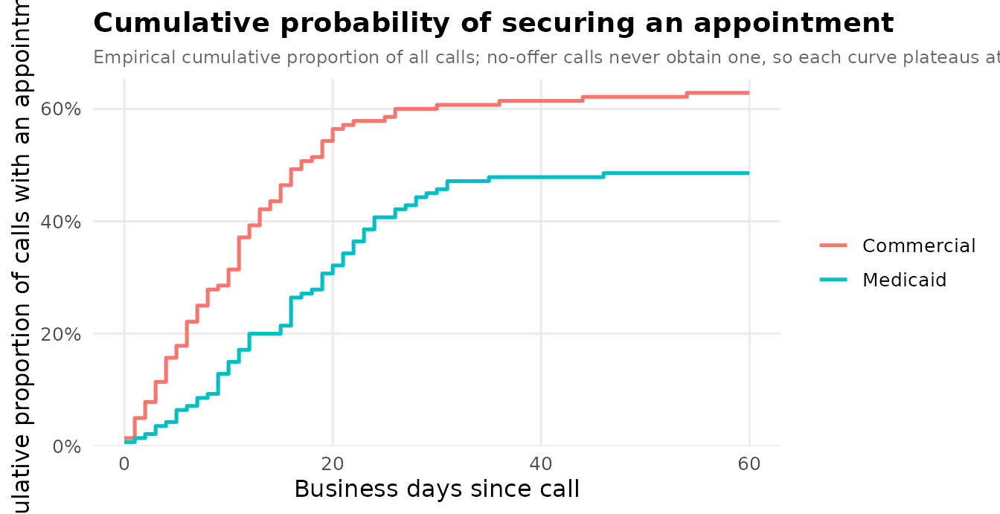

# A matched-pair mystery-caller analysis

This vignette walks a complete matched-pair mystery-caller analysis end
to end, using the tools added for auditing healthcare access. The
**matched-pair design** — the same practice called under two insurance
scenarios — is the paradigm the package is built around: pairing removes
each practice’s baseline generosity, so a difference between scenarios
is not confounded by *which* practices happened to be called.

``` r

library(mysterycall)
```

## 1. A simulated study

We simulate 140 practices, each called twice (Commercial and Medicaid),
with a per-practice random effect so the two calls to one practice are
correlated. The data are in **long** form: one row per practice ×
scenario.

``` r

set.seed(2026)
np <- 140L

subspecialty <- sample(c("General", "Pediatric", "Rhinology", "Laryngology"),
                       np, TRUE, prob = c(.45, .25, .18, .12))
region <- sample(c("Northeast", "South", "Midwest", "West"), np, TRUE)
caller <- sample(paste0("RA", 1:5), np, TRUE)
u      <- rnorm(np, 0, 0.7)                              # practice generosity
cbsa   <- ifelse(runif(np) < 0.72,
                 sprintf("C%05d", sample(10000:40000, np, TRUE)), NA_character_)
cfips  <- sprintf("%05d", sample(1001:56045, np, TRUE))

d <- data.frame(
  practice = rep(seq_len(np), times = 2L),
  scenario = rep(c("Commercial", "Medicaid"), each = np),
  stringsAsFactors = FALSE
)
d$subspecialty <- subspecialty[d$practice]
d$region       <- region[d$practice]
d$caller       <- caller[d$practice]
d$cbsa_code    <- cbsa[d$practice]
d$county_fips  <- cfips[d$practice]

medicaid <- d$scenario == "Medicaid"
sub_off  <- c(General = 0, Pediatric = -0.3, Rhinology = 0.2, Laryngology = 0.1)
eta      <- 1.1 - 1.0 * medicaid + u[d$practice] + sub_off[d$subspecialty]

d$office_answered     <- runif(nrow(d)) < 0.94
d$appointment_offered <- d$office_answered & (runif(nrow(d)) < plogis(eta))
d$taking_new_patients <- ifelse(d$appointment_offered | runif(nrow(d)) < 0.6,
                                "Yes", "No")

sub_wait <- c(General = 0, Pediatric = 0.15, Rhinology = 0.1, Laryngology = 0.2)
mu_wait  <- exp(2.4 + 0.45 * medicaid + sub_wait[d$subspecialty])
d$wait_days_business <- ifelse(
  d$appointment_offered, rnbinom(nrow(d), mu = mu_wait, size = 2), NA_real_)

d$appointment_outcome <- ifelse(
  d$appointment_offered,
  sample(c("With sampled physician", "With different physician"),
         nrow(d), TRUE, c(.8, .2)),
  "No appointment offered")

# a `complete` flag: a handful of calls never reached a determination
d$complete <- d$office_answered | runif(nrow(d)) < 0.5

head(d)
#>   practice   scenario subspecialty    region caller cbsa_code county_fips
#> 1        1 Commercial    Pediatric      West    RA1    C18767       50173
#> 2        2 Commercial    Pediatric Northeast    RA4    C14100       30599
#> 3        3 Commercial      General   Midwest    RA5    C30688       34473
#> 4        4 Commercial      General   Midwest    RA2    C18966       46502
#> 5        5 Commercial    Pediatric Northeast    RA3    C31877       25887
#> 6        6 Commercial      General Northeast    RA5      <NA>       53447
#>   office_answered appointment_offered taking_new_patients wait_days_business
#> 1           FALSE               FALSE                 Yes                 NA
#> 2           FALSE               FALSE                 Yes                 NA
#> 3            TRUE                TRUE                 Yes                  4
#> 4           FALSE               FALSE                  No                 NA
#> 5            TRUE               FALSE                 Yes                 NA
#> 6            TRUE                TRUE                 Yes                  5
#>      appointment_outcome complete
#> 1 No appointment offered     TRUE
#> 2 No appointment offered    FALSE
#> 3 With sampled physician     TRUE
#> 4 No appointment offered    FALSE
#> 5 No appointment offered     TRUE
#> 6 With sampled physician     TRUE
```

To make the data-integrity tools earn their keep, we deliberately
introduce two kinds of contradiction that creep into real call logs:

``` r

# (a) a wait time recorded even though no appointment was offered
d$appointment_offered[5]  <- FALSE
d$appointment_outcome[5]  <- "No appointment offered"
d$wait_days_business[5]   <- 14

# (b) the offered flag disagrees with the authoritative outcome
d$appointment_offered[8]  <- FALSE                       # says "not offered" ...
d$appointment_outcome[8]  <- "With sampled physician"    # ... but an appt was made
```

## 2. A clustering key for mixed models

The mixed-model fitters need a `random_intercept` column, but our
geography is split across a metro code that only some practices have and
a county code for the rest.
[`mysterycall_cluster_id()`](https://mufflyt.github.io/mysterycall/reference/mysterycall_cluster_id.md)
coalesces them, giving any still-missing row its own singleton so it
never silently collapses into one giant cluster.

``` r

d$cluster <- mysterycall_cluster_id(d, c("cbsa_code", "county_fips"))
head(d$cluster)
#> [1] "C18767" "C14100" "C30688" "C18966" "C31877" "53447"
```

## 3. Data integrity

[`mysterycall_check_consistency()`](https://mufflyt.github.io/mysterycall/reference/mysterycall_check_consistency.md)
runs a battery of cross-field rules and returns a single priority-sorted
worklist. The defaults include `WAIT_NO_OFFER`, which catches
contradiction (a) above.

``` r

issues <- mysterycall_check_consistency(d, id_col = "practice")
issues
#> <mysterycall consistency report: 1 rows flagged by 1 of 5 rules>
#> 
#> By priority / flag:
#> # A tibble: 1 × 3
#>   priority flag              n
#>   <chr>    <chr>         <int>
#> 1 HIGH     WAIT_NO_OFFER     1
#> 
#> # A tibble: 1 × 6
#>     row practice flag          priority description                       action
#>   <int>    <int> <chr>         <fct>    <chr>                             <chr> 
#> 1     5        5 WAIT_NO_OFFER HIGH     A wait time is recorded but no a… Clear…
```

[`mysterycall_reconcile_offer_outcome()`](https://mufflyt.github.io/mysterycall/reference/mysterycall_reconcile_offer_outcome.md)
finds — and here fixes — rows where the binary offer flag contradicts
the granular outcome (contradiction (b)), treating the detailed outcome
as authoritative and clearing any stray wait/date when a row flips to
“not offered”.

``` r

rec <- mysterycall_reconcile_offer_outcome(
  d,
  flag_col           = "appointment_offered",
  outcome_col        = "appointment_outcome",
  offered_values     = c("With sampled physician", "With different physician"),
  not_offered_values = "No appointment offered",
  dependent_cols     = "wait_days_business",
  action             = "fix",
  id_col             = "practice"
)
rec
#> <mysterycall offer/outcome reconciliation [fix]>
#>   flag understates outcome (-> offered):     1
#>   flag overstates outcome (-> not offered):  0
#> 
#> Discordant rows:
#> # A tibble: 1 × 6
#>     row practice flag  outcome                direction        suggested
#>   <int>    <int> <lgl> <chr>                  <chr>            <chr>    
#> 1     8        8 FALSE With sampled physician flag_understates offered
d <- rec$data          # continue with the reconciled data
```

## 4. The access cascade

Simulated-patient studies report a *cascade* of intermediate access
measures.
[`mysterycall_access_cascade()`](https://mufflyt.github.io/mysterycall/reference/mysterycall_access_cascade.md)
turns an ordered set of stage definitions into a count / denominator /
percent table with Wilson intervals, and an optional funnel figure.

``` r

cascade <- mysterycall_access_cascade(d, list(
  mysterycall_cascade_stage("Reached a live office", "office_answered", TRUE),
  mysterycall_cascade_stage("Accepting new patients", "taking_new_patients", "Yes"),
  mysterycall_cascade_stage("Appointment offered", "appointment_offered", TRUE),
  mysterycall_cascade_stage("With the sampled physician", "appointment_outcome",
                            "With sampled physician")
), plot = TRUE)
cascade
#> <mysterycall access cascade: 4 stages, 280 analytic calls>
#> # A tibble: 4 × 6
#>   group          measure                        n denominator pct   ci          
#>   <chr>          <chr>                      <int>       <int> <chr> <chr>       
#> 1 Access cascade Reached a live office        254         280 90.7% [86.7, 93.6]
#> 2 Access cascade Accepting new patients       235         280 83.9% [79.2, 87.8]
#> 3 Access cascade Appointment offered          158         280 56.4% [50.6, 62.1]
#> 4 Access cascade With the sampled physician   138         280 49.3% [43.5, 55.1]
#> 
#> $plot: a ggplot funnel figure is attached.
```

``` r

cascade$plot
```



## 5. Bounds under non-response

Not every call completes. Rather than quietly condition the offer rate
on the completed calls,
[`mysterycall_outcome_bounds()`](https://mufflyt.github.io/mysterycall/reference/mysterycall_outcome_bounds.md)
reports the assumption-free Manski interval: assign every incomplete
call first to failure, then to success.

``` r

mysterycall_outcome_bounds(d, "appointment_offered", observed = "complete")
#> <mysterycall outcome bounds under non-response>
#>   universe 280 = observed 266 + missing 14; positives 158
#>   complete-case rate: 59.4%  (95% CI 53.4%-65.1%)
#>   bounds over universe: [56.4% (all missing fail), 61.4% (all succeed)]  width 5.0%
```

## 6. Time to an appointment

For a single-contact design the correct time-to-event primitive is the
empirical cumulative proportion offered by business-day *t* — **not** a
Kaplan–Meier curve, which would censor the never-offered calls and imply
follow-up the design does not have. Each curve plateaus at that
scenario’s offer rate.

``` r

curve <- mysterycall_cumulative_access_curve(
  d, time_col = "wait_days_business", offered_col = "appointment_offered",
  group_col = "scenario", horizon = 60, plot = TRUE)
curve$plateau
#> # A tibble: 2 × 3
#>   group      offer_rate     n
#>   <chr>           <dbl> <int>
#> 1 Commercial      0.636   140
#> 2 Medicaid        0.493   140
curve$plot
```



## 7. The matched comparison

Now the heart of the design. Only practices called under **both**
scenarios contribute, and for the binary acceptance outcome only the
*discordant* practices (a different answer to the two callers) carry
information — so the effective sample size is the discordant count.
[`mysterycall_paired_acceptance_mcnemar()`](https://mufflyt.github.io/mysterycall/reference/mysterycall_paired_acceptance_mcnemar.md)
runs the exact McNemar test.

``` r

d$accepted <- d$appointment_offered
mysterycall_paired_acceptance_mcnemar(
  d, id_col = "practice", scenario_col = "scenario", outcome_col = "accepted")
#> <mysterycall paired McNemar: 1 contrast(s), MDE at 80% power>
#> # A tibble: 1 × 9
#>   contrast   n_paired concordant discordant disc_favor_a disc_favor_b odds_ratio
#>   <chr>         <int>      <int>      <int>        <int>        <int>      <dbl>
#> 1 Commercia…      140         78         62           41           21       1.95
#> # ℹ 2 more variables: mcnemar_p <dbl>, mde_or_power <dbl>
```

The continuous analogue pairs the within-practice wait differences:

``` r

mysterycall_paired_wait_within_practice(
  d, id_col = "practice", scenario_col = "scenario",
  wait_col = "wait_days_business")
#> <mysterycall paired wait: 1 contrast(s), MDE at 80% power>
#> # A tibble: 1 × 9
#>   contrast          n_paired mean_diff_days ci_lower ci_upper sd_diff paired_t_p
#>   <chr>                <int>          <dbl>    <dbl>    <dbl>   <dbl>      <dbl>
#> 1 Commercial vs Me…       48          -7.83    -12.3    -3.33    15.5    0.00103
#> # ℹ 2 more variables: wilcoxon_p <dbl>, mde_days_power <dbl>
```

## 8. Small-sample categorical and rank tests

For the unmatched views, the categorical toolkit auto-selects chi-square
or an exact test by expected cell counts and reports Cramér’s V:

``` r

mysterycall_test_categorical(d, row_var = "scenario", col_var = "appointment_offered")
#> <mysterycall_categorical_test> scenario x appointment_offered
#>   Pearson's chi-squared (Yates' correction)
#>   statistic = 5.244, df = 1, p = 0.022
#>   Cramer's V = 0.144 (small); n = 280
```

Offer prevalence with Wilson intervals, by scenario:

``` r

mysterycall_prevalence_ci(d, var = "appointment_offered", group_var = "scenario")
#> # A tibble: 4 × 8
#>   group      category     n total proportion ci_lower ci_upper method
#>   <chr>      <chr>    <int> <int>      <dbl>    <dbl>    <dbl> <chr> 
#> 1 Commercial FALSE       51   140      0.364    0.289    0.447 wilson
#> 2 Commercial TRUE        89   140      0.636    0.553    0.711 wilson
#> 3 Medicaid   FALSE       71   140      0.507    0.425    0.589 wilson
#> 4 Medicaid   TRUE        69   140      0.493    0.411    0.575 wilson
```

A Cochran–Mantel–Haenszel test holds region constant while comparing
scenarios:

``` r

mysterycall_cmh_test(d, outcome_var = "appointment_offered",
                     group_var = "scenario", strata_var = "region")
#> <mysterycall_cmh_test> 4 strata, n = 280
#>   Mantel-Haenszel chi-squared test with continuity correction
#>   statistic = 5.222, df = 1, p = 0.022
#>   common OR = 0.558 (95% CI 0.346-0.899)
```

Wait times are skewed counts, so compare them with ranks — here across
the four subspecialties, among offered calls:

``` r

offered <- d[d$appointment_offered & !is.na(d$wait_days_business), ]
mysterycall_compare_ranks(offered, outcome_var = "wait_days_business",
                          group_var = "subspecialty")
#> <mysterycall_rank_comparison> wait_days_business by subspecialty
#>   Kruskal-Wallis
#>   statistic = 2.996, df = 3, p = 0.392
#>   effect size epsilon-squared = 0.019; n = 157
#>        group  n median   q1    q3
#>      General 91     11  5.0 19.00
#>  Laryngology 16     16 11.5 23.00
#>    Pediatric 26     12  8.5 18.50
#>    Rhinology 24     10  6.5 20.25
```

## 9. Call outcomes and guideline concordance

Raw dispositions map to a standard taxonomy via an ordered keyword list
(first match wins):

``` r

raw <- ifelse(d$appointment_offered, "appointment scheduled",
       sample(c("not accepting new medicaid patients", "no openings for months",
                "does not treat this complaint", "left a voicemail"),
              nrow(d), TRUE))
table(mysterycall_classify_call_outcome(raw))
#> 
#>                     not_reached             gatekeeping_no_info 
#>                              29                               0 
#> insurance_verification_required               referral_required 
#>                               0                               0 
#>                records_required         new_patient_restriction 
#>                               0                              23 
#>                        declined             appointment_offered 
#>                               0                             158 
#>                           other 
#>                              70
```

For a guideline-concordance study, build a rubric and score each call
transcript against it. Here three binary items on counseling quality:

``` r

rubric <- mysterycall_concordance_rubric(
  item  = c("explained_wait", "offered_alternative", "gave_callback"),
  label = c("Explained the expected wait", "Offered an alternative site",
            "Gave a call-back number"),
  type  = "binary", correct = TRUE)

set.seed(11)
transcripts <- data.frame(
  explained_wait      = rbinom(80, 1, 0.7) == 1,
  offered_alternative = rbinom(80, 1, 0.4) == 1,
  gave_callback       = rbinom(80, 1, 0.6) == 1
)
mysterycall_score_concordance(transcripts, rubric, output_dir = NA)
#> <mysterycall_concordance: 80 calls, 3 items>
#>   composite: mean 60.0% (median 66.7%, sd 27.3), 3.0 items/call applicable
#>   item concordance:
#>     Explained the expected wait   85.0% (n=80)
#>     Offered an alternative site   38.8% (n=80)
#>     Gave a call-back number       56.2% (n=80)
```

## 10. Adjusted model and robustness

Fit an adjusted model for the offer, then interrogate it. (We use a base
`glm` here for speed;
[`mysterycall_logistic_model()`](https://mufflyt.github.io/mysterycall/reference/mysterycall_logistic_model.md)
gives the mixed-model version and the same robustness helpers accept its
objects.)

``` r

fit <- glm(appointment_offered ~ scenario + subspecialty + region,
           family = binomial, data = d)
round(exp(cbind(OR = coef(fit), confint.default(fit)))["scenarioMedicaid", ], 2)
#>     OR  2.5 % 97.5 % 
#>   0.54   0.33   0.88
```

Is subspecialty jointly informative?
[`mysterycall_joint_test()`](https://mufflyt.github.io/mysterycall/reference/mysterycall_joint_test.md)
runs the joint likelihood-ratio test, computing the degrees of freedom
from the log-likelihoods (which sidesteps a well-known
`glmer`-vs-`glmmTMB` column-naming footgun):

``` r

mysterycall_joint_test(fit, "subspecialty")
#> <mysterycall joint LRT: subspecialty>
#>   chi-square(3) = 8.97, p = 0.0296
#>   dropped: subspecialty
```

Does the Medicaid effect hinge on any single caller?
[`mysterycall_leave_one_out()`](https://mufflyt.github.io/mysterycall/reference/mysterycall_leave_one_out.md)
refits with each caller dropped in turn:

``` r

mysterycall_leave_one_out(fit, d, group = "caller", term = "scenarioMedicaid",
                          joint_predictor = "subspecialty")
#> <mysterycall leave-one-group-out: term 'scenarioMedicaid', 5 refits>
#>   full-data ratio: 0.54 (p = 0.0143)
#> # A tibble: 5 × 8
#>   group_excluded     n estimate ratio std_error p_value joint_p converged
#>   <chr>          <int>    <dbl> <dbl>     <dbl>   <dbl>   <dbl> <lgl>    
#> 1 RA1              218   -0.404 0.668     0.285 0.157   0.00509 TRUE     
#> 2 RA2              204   -0.942 0.390     0.299 0.00164 0.198   TRUE     
#> 3 RA3              236   -0.621 0.537     0.273 0.0229  0.00926 TRUE     
#> 4 RA4              228   -0.637 0.529     0.276 0.0212  0.0596  TRUE     
#> 5 RA5              234   -0.510 0.600     0.272 0.0604  0.103   TRUE
```

## 11. Power, for the next study

Access audits have a two-part outcome — a binary offer on the full
sample and a wait time only among offered calls — so both parts must be
powered.
[`mysterycall_twopart_power()`](https://mufflyt.github.io/mysterycall/reference/mysterycall_twopart_power.md)
simulates both.

``` r

mysterycall_twopart_power(
  n_total = c(200, 400), offer_ref = 0.75, offer_trt = 0.55,
  wait_ref = 14, wait_trt = 21, phi = 1.7, n_sim = 60, seed = 1)
#> <mysterycall two-part power: 2 sample size(s), 60 sims, alpha 0.050>
#> # A tibble: 2 × 8
#>   n_total n_ref n_trt pow_offer pow_wait mean_offered convergence_rate n_sim
#>     <dbl> <dbl> <dbl>     <dbl>    <dbl>        <dbl>            <dbl> <dbl>
#> 1     200   100   100     0.783    0.817         130.                1    60
#> 2     400   200   200     1        0.967         260.                1    60
```

Any simulation-based power should be sanity-checked for calibration —
the rejection rate under the null must sit near α.
[`mysterycall_type_i_check()`](https://mufflyt.github.io/mysterycall/reference/mysterycall_type_i_check.md)
turns an observed null-rejection count into a verdict:

``` r

mysterycall_type_i_check(rejections = 4, n_sim = 100, alpha = 0.05)
#> # A tibble: 1 × 6
#>   rejection_rate ci_low ci_high n_sim alpha_in_ci verdict                      
#>            <dbl>  <dbl>   <dbl> <dbl> <lgl>       <chr>                        
#> 1           0.04 0.0110  0.0993   100 TRUE        consistent with nominal alpha
```

And
[`mysterycall_find_mde()`](https://mufflyt.github.io/mysterycall/reference/mysterycall_find_mde.md)
bisects any power function to the smallest detectable effect at a target
power — here the smallest Medicaid wait (in days) detectable at 80%
power with 400 calls:

``` r

pf <- function(wait_trt) {
  mysterycall_twopart_power(
    n_total = 400, offer_ref = 0.7, offer_trt = 0.7,
    wait_ref = 14, wait_trt = wait_trt, phi = 1.7, n_sim = 30, seed = 1
  )$table$pow_wait
}
mysterycall_find_mde(pf, lower = 14, upper = 26, target_power = 0.80,
                     tol = 0.5, max_iter = 8)$mde
#> [1] 18.5
```

When a study oversamples a rare stratum but wants a
population-generalizable effect,
[`mysterycall_marginal_power()`](https://mufflyt.github.io/mysterycall/reference/mysterycall_marginal_power.md)
powers the post-stratification-weighted marginal estimand (it needs
`glmmTMB` and `marginaleffects`):

``` r

mysterycall_marginal_power(
  n_subject = c(150, 300),
  cell_means = c(14, 18, 17, 24),      # Commercial/Medicaid x urban/rural waits
  sigma_subject = 0.4, phi = 1.7,
  stratum_sampling = 0.5, pop_stratum = 0.15,
  n_sim = 200, seed = 1)
```

## Recap

One long call log, start to finish: a clustering key, two integrity
passes, the access cascade, non-response bounds, the cumulative-access
curve, the matched McNemar and paired-wait comparisons, small-sample
categorical and rank tests, outcome classification and guideline
concordance, an adjusted model with a joint test and leave-one-out
sensitivity, and simulation-based power for the follow-up study — each a
single function call.
