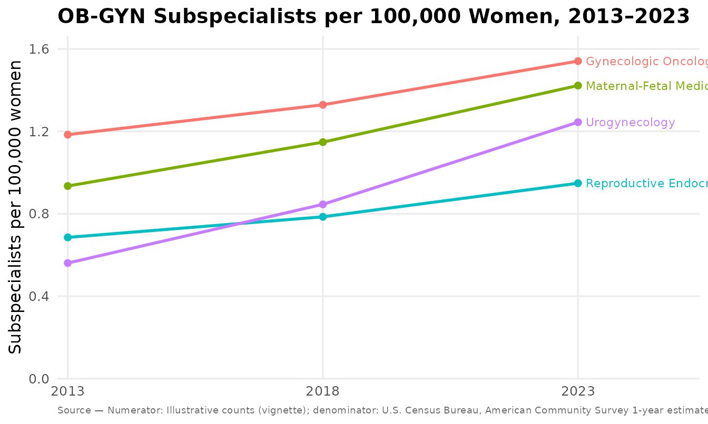

# Subspecialist density per 100,000 women

Workforce-density figures — *subspecialists per 100,000 women* — turn
raw provider counts into an access metric a reader can compare across
subspecialties and over time. This vignette walks the full path:
**counts + denominator → density → figure**, with the provenance that
keeps the picture honest.

Two figures share the same computation:

- [`mysterycall_subspecialist_trend()`](https://mufflyt.github.io/mysterycall/reference/mysterycall_subspecialist_trend.md)
  — a multi-year line trend (one line per subspecialty), optionally with
  confidence bands.
- [`mysterycall_subspecialist_infographic()`](https://mufflyt.github.io/mysterycall/reference/mysterycall_subspecialist_infographic.md)
  — a two-point (start → end) badge infographic.

The density is always derived from the inputs
(`count / population * 100000`), never typed, so a figure cannot
disagree with its own numbers.

## 1. The numerator: subspecialist counts

You supply the counts. A long data frame is the most flexible form — one
row per subspecialty per year:

``` r

counts <- data.frame(
  subspecialty = rep(c("Gynecologic Oncology", "Maternal-Fetal Medicine",
                       "Reproductive Endocrinology & Infertility",
                       "Urogynecology"), each = 3),
  year  = rep(c(2013, 2018, 2023), times = 4),
  count = c(1900, 2200, 2600,   # Gyn Onc
            1500, 1900, 2400,   # MFM
            1100, 1300, 1600,   # REI
             900, 1400, 2100)   # Urogyn
)
head(counts)
#>              subspecialty year count
#> 1    Gynecologic Oncology 2013  1900
#> 2    Gynecologic Oncology 2018  2200
#> 3    Gynecologic Oncology 2023  2600
#> 4 Maternal-Fetal Medicine 2013  1500
#> 5 Maternal-Fetal Medicine 2018  1900
#> 6 Maternal-Fetal Medicine 2023  2400
```

Wide data frames (a `subspecialty` column plus one column per year) and
matrices (subspecialty rows, year columns) are accepted too.

## 2. The denominator: total female population

The denominator is the **total female population** for each year. If you
have a Census API key you can fetch it directly (ACS table `B01001`,
variable `B01001_026E`):

``` r

# Requires CENSUS_API_KEY and an internet connection.
fem_pop <- mysterycall_census_female_population(
  years  = c(2013, 2018, 2023),
  survey = "acs5"            # 5-year: available for every year, incl. 2020
)
fem_pop
```

The ACS **1-year** table was not released for 2020; when you request
`survey = "acs1"`, `fill_2020` chooses whether to substitute the 5-year
value (default), return `NA`, or error.

For a reproducible vignette we just supply the values directly — a
year-named vector, an ordered vector, or a
`data.frame(year, population)` all work:

``` r

fem_pop <- c(`2013` = 160477237, `2018` = 165553033, `2023` = 168731234)
```

> These illustrative denominators are placeholders — swap in your own
> cited Census figures.

## 3. The trend figure

``` r

p <- mysterycall_subspecialist_trend(
  counts,
  population       = fem_pop,
  numerator_source = "Illustrative counts (vignette)",
  accessed         = "2026-08-02"
)
p
```



The returned object’s `$data` carries every computed value, so nothing
is hidden behind the plot:

``` r

head(p$data)
#>              subspecialty year count population  density
#> 1    Gynecologic Oncology 2013  1900  160477237 1.183969
#> 2    Gynecologic Oncology 2018  2200  165553033 1.328879
#> 3    Gynecologic Oncology 2023  2600  168731234 1.540912
#> 4 Maternal-Fetal Medicine 2013  1500  160477237 0.934712
#> 5 Maternal-Fetal Medicine 2018  1900  165553033 1.147668
#> 6 Maternal-Fetal Medicine 2023  2400  168731234 1.422380
```

### Confidence intervals

A per-100,000 rate is a count over a population, so it has an exact
Poisson confidence interval. Set `conf_level` to draw it as a band and
add `density_low` / `density_high` to `$data`:

``` r

p_ci <- mysterycall_subspecialist_trend(counts, population = fem_pop,
                                        conf_level = 0.95)
head(p_ci$data[, c("subspecialty", "year", "density",
                   "density_low", "density_high")])
#>              subspecialty year  density density_low density_high
#> 1    Gynecologic Oncology 2013 1.183969   1.1313244    1.2384302
#> 2    Gynecologic Oncology 2018 1.328879   1.2739243    1.3855952
#> 3    Gynecologic Oncology 2023 1.540912   1.4822458    1.6013051
#> 4 Maternal-Fetal Medicine 2013 0.934712   0.8880029    0.9832404
#> 5 Maternal-Fetal Medicine 2018 1.147668   1.0966384    1.2004603
#> 6 Maternal-Fetal Medicine 2023 1.422380   1.3660378    1.4804502
```

### A statistic, not just a line

`trend_test` fits a per-subspecialty log-linear regression of count on
year (offset `log(population)`) — a model of the rate’s annual change —
and attaches the tidy result. Each line’s end label also gains the rate
ratio per year and a significance star.

``` r

p_stat <- mysterycall_subspecialist_trend(counts, population = fem_pop,
                                          trend_test = "quasipoisson")
attr(p_stat, "trend_test")[, c("subspecialty", "rr_per_year",
                               "conf_low", "conf_high", "p_value")]
#>                               subspecialty rr_per_year  conf_low conf_high
#> 1                     Gynecologic Oncology    1.026876 1.0026435  1.051693
#> 2                  Maternal-Fetal Medicine    1.042955 1.0358176  1.050142
#> 3 Reproductive Endocrinology & Infertility    1.033326 0.9942208  1.073970
#> 4                            Urogynecology    1.082605 1.0634631  1.102091
#>       p_value
#> 1 0.045040196
#> 2 0.008180361
#> 3 0.058793510
#> 4 0.011260072
```

Use `"quasipoisson"` when the counts are overdispersed; the p-value then
comes from a t-test on the overdispersion-scaled standard error.

## 4. The two-point infographic

When you only need the endpoints, the infographic renders a badge per
subspecialty with the percent change derived from the two densities:

``` r

ends <- subset(counts, year %in% c(2013, 2023))
d13 <- ends$count[ends$year == 2013] / fem_pop["2013"] * 1e5
d23 <- ends$count[ends$year == 2023] / fem_pop["2023"] * 1e5

mysterycall_subspecialist_infographic(
  subspecialty = unique(ends$subspecialty),
  start = as.numeric(d13),
  end   = as.numeric(d23)
)
```

## 5. Provenance travels with the figure

Every figure records where its numbers came from. The record is attached
to the object and printed on the figure as a source caption:

``` r

attr(p, "provenance")
#> mysterycall — figure provenance
#> ==================================
#> Metric:         Subspecialists per 100,000 women
#> Computation:    density = count / population * 100000
#> Numerator:      Subspecialist counts by subspecialty and year (user-supplied)
#>   num. source:  Illustrative counts (vignette)
#> Denominator:    Total female population by year
#>   den. source:  U.S. Census Bureau, American Community Survey 1-year estimates, table B01001 (B01001_026E, total female population)
#> Scale (per):    100000
#> Years:          2013–2023
#> Series:         4
#> Generated by:   mysterycall::mysterycall_subspecialist_trend()
#> Pkg version:    1.6.3.9000
#> Data accessed:  2026-08-02
#> Created:        2026-09-06 14:10:50.268548
```

Saving a figure also writes provenance sidecars next to the image — a
human-readable `.provenance.txt` and, when **jsonlite** is installed, a
machine-readable `.provenance.json` (schema `mysterycall/provenance`)
carrying the record and the per-point table:

``` r

mysterycall_subspecialist_trend(
  counts, population = fem_pop,
  numerator_source = "ABOG certified-diplomate counts, 2013-2023",
  accessed = "2026-08-02",
  output_path = "subspecialists_per_100k.png"
)
#> Saved: subspecialists_per_100k.png
#> Provenance: subspecialists_per_100k.provenance.txt
#> Provenance: subspecialists_per_100k.provenance.json
```

That trio — image, human-readable provenance, machine-readable
provenance — is what makes the figure reproducible in an analysis
pipeline.
