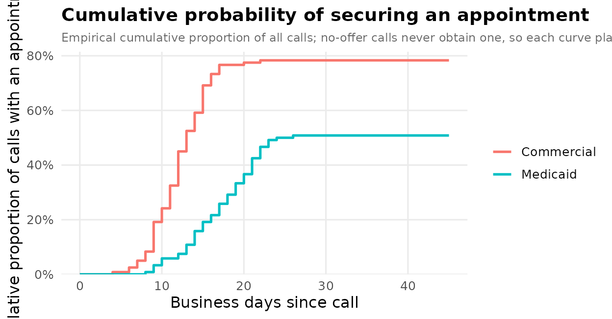

# Assembling supplementary digital content

Journals rarely print a mystery-caller study’s full model tables,
sensitivity analyses, reporting checklist, and participant-flow diagram
in the main text — those go in the **supplementary digital content
(SDC)**, uploaded as separate files. This vignette assembles that
package: the supplementary tables and figures, a STROBE checklist, and
the export steps, each generated from the fitted models so the SDC stays
consistent with the manuscript and is trivial to regenerate when the
data change.

``` r

library(mysterycall)
```

## 1. The analysis behind the SDC

A mystery-caller study of insurance-based access has two outcomes:
whether an appointment was offered, and the wait in business days among
offers. We simulate a small paired call log and fit both models — a
logistic GLMM for the offer and a Poisson GLMM for the wait.

``` r

set.seed(2026)
n <- 120
d <- data.frame(
  npi        = rep(sprintf("1%09d", seq_len(n)), each = 2),
  insurance  = rep(c("Commercial", "Medicaid"), n),
  region     = rep(sample(c("Northeast", "South", "West"), n, TRUE), each = 2)
)
med <- d$insurance == "Medicaid"
d$appt_offered <- rbinom(nrow(d), 1, plogis(1.1 - 0.9 * med))
d$wait_days    <- ifelse(d$appt_offered == 1,
                         rpois(nrow(d), ifelse(med, 18, 12)), NA)

offer_crude    <- mysterycall_logistic_model(d, "appt_offered", "insurance", "npi")
offer_adjusted <- mysterycall_logistic_model(
  d, "appt_offered", c("insurance", "region"), "npi")
wait_model <- mysterycall_poisson_model(
  d[d$appt_offered == 1, ], outcome = "wait_days",
  predictors = "insurance", random_intercept = "npi")
```

## 2. Supplementary tables

**Table S1 — model estimates (crude vs. adjusted).**
[`mysterycall_multi_model_table()`](https://mufflyt.github.io/mysterycall/reference/mysterycall_multi_model_table.md)
places nested models side by side, the usual “did adjustment move the
estimate?” supplementary table.

``` r

tS1 <- mysterycall_multi_model_table(
  list(Crude = offer_crude, Adjusted = offer_adjusted))
tS1
#> Multi-model regression table  [OR (95% CI)]
#> ------------------------------------------------------------ 
#>  Term                Crude                        Adjusted                    
#>  insuranceCommercial Ref.                         Ref.                        
#>  insuranceMedicaid   0.29 (0.16-0.50) | p=< 0.001 0.28 (0.16-0.50) | p=< 0.001
#>  regionNortheast                                  Ref.                        
#>  regionSouth                                      1.16 (0.59-2.28) | p=0.669  
#>  regionWest                                       1.44 (0.72-2.85) | p=0.299  
#>  N                   240                          240                         
#>  AIC                 297.8                        300.7                       
#> ------------------------------------------------------------
```

**Table S2 — the disparity, with confidence intervals.**

``` r

tS2 <- mysterycall_disparities_table(d, "appt_offered", "insurance",
                                     ref_group = "Commercial")
tS2
#> Disparity table -- 2 groups | ref: 'Commercial' | wilson 95% CI
#> Group                       n  n_acc     Rate  95% CI            Abs.Diff  RR (95% CI)             p-value
#> ---------------------------------------------------------------------------------------------------- 
#> Commercial                120     94    78.3%  70.1%-84.8%          (ref)  1.00 (ref)              (ref)
#> Medicaid                  120     61    50.8%  42.0%-59.6%       -27.5 pp  0.65 (0.53-0.79)        p < 0.001
```

**Table S3 — adjusted effect on the absolute scale.**
[`mysterycall_combined_results_table()`](https://mufflyt.github.io/mysterycall/reference/mysterycall_combined_results_table.md)
reports the wait model’s rate ratio alongside the implied difference in
days.

``` r

tS3 <- mysterycall_combined_results_table(wait_model)
tS3
#>                Term  IRR IRR 95% CI p-value Days Diff Days 95% CI Significance
#> 1 insuranceMedicaid 1.41  1.30-1.54 < 0.001      <NA>        <NA>            *
```

**Table S4 — this study in the context of prior work.**
[`mysterycall_literature_table()`](https://mufflyt.github.io/mysterycall/reference/mysterycall_literature_table.md)
stacks your estimate against published ones.

``` r

prior <- data.frame(
  author = c("Pollack 2016", "Sharma 2025"),
  year = c(2016, 2025),
  insurance_comparison = "Medicaid vs Commercial",
  n = c(1200, 480),
  or = c(0.42, 0.55), ci_lower = c(0.35, 0.40), ci_upper = c(0.51, 0.75),
  specialty = c("Urology", "OBGYN"))
mysterycall_literature_table(prior)
#> 
#> -- Mystery-caller literature comparison (2 studies) --
#> 
#>        Author Year Specialty             Comparison    N      OR (95% CI)
#>  Pollack 2016 2016   Urology Medicaid vs Commercial 1200 0.42 (0.35-0.51)
#>   Sharma 2025 2025     OBGYN Medicaid vs Commercial  480 0.55 (0.40-0.75)
#>           Direction
#>  Disparity detected
#>  Disparity detected
#> 
#> OR range: 0.42-0.55
#> 
#> Discussion sentence:
#> Across 2 mystery-caller studies, ORs for Medicaid vs Commercial ranged from 0.42-0.55.
```

**A one-file bundle.**
[`mysterycall_supplemental_tables()`](https://mufflyt.github.io/mysterycall/reference/mysterycall_supplemental_tables.md)
writes every model table into a single formatted workbook for upload
(needs the openxlsx package).

``` r

xlsx <- mysterycall_supplemental_tables(
  logistic_fit = offer_adjusted, poisson_fit = wait_model,
  file = file.path(sdc_dir, "supplemental_tables.xlsx"), overwrite = TRUE)
basename(xlsx)
#> [1] "supplemental_tables.xlsx"
```

## 3. Supplementary figures, at journal specification

**Figure S1 — forest plot of the offer model.**

``` r

figS1 <- mysterycall_forest_plot(offer_adjusted, x_label = "Odds ratio (95% CI)")
```


``` r

figS1
```


**Figure S2 — incidence-rate-ratio plot of the wait model.**

``` r

mysterycall_irr_plot(wait_model)
```


**Figure S3 — cumulative time to an appointment**, the correct
single-contact time-to-event display:

``` r

curve <- mysterycall_cumulative_access_curve(
  d, time_col = "wait_days", offered_col = "appt_offered",
  group_col = "insurance", horizon = 45, plot = TRUE)
curve$plot
```



**Save at the journal’s column width.**
[`mysterycall_save_green_journal_figure()`](https://mufflyt.github.io/mysterycall/reference/mysterycall_save_green_journal_figure.md)
writes a figure at *Obstetrics & Gynecology* specifications (sized to a
single or double column, at print DPI) and returns the path.

``` r

paths <- mysterycall_save_green_journal_figure(
  figS1, file.path(sdc_dir, "figS1_forest"), layout = "single_column")
basename(paths)
#> [1] "figS1_forest.tiff"     "figS1_forest.pdf"      "figS1_forest.png"     
#> [4] "figS1_forest_data.csv"
```

## 4. The reporting checklist

Observational studies ship a STROBE checklist.
[`mysterycall_strobe_checklist()`](https://mufflyt.github.io/mysterycall/reference/mysterycall_strobe_checklist.md)
builds one from the fitted model, pre-filling the items it can verify:

``` r

head(mysterycall_strobe_checklist(wait_model), 8)
#> STROBE Checklist for Mystery-Caller Study
#> ================================================== 
#> [WARN] Item  1  Title/Abstract: Study design stated in title or abstract
#>          Cannot auto-detect; verify manually.
#> [WARN] Item  2  Introduction: Scientific background and objectives stated
#>          Cannot auto-detect; verify manually.
#> [WARN] Item  3  Methods: Setting, locations, and dates described
#>          Cannot auto-detect; verify manually.
#> [WARN] Item  4  Methods: Eligibility criteria for participants stated
#>          Cannot auto-detect; verify manually.
#> [WARN] Item  5  Methods: Mystery-caller protocol described (script, blinding, call timing)
#>          Cannot auto-detect; verify manually.
#> [WARN] Item  6  Methods: Sample size justified
#>          No power/sample_size field found. Verify that a power analysis is reported.
#> [PASS] Item  7  Methods: Statistical methods: model family specified
#>          Model class 'mysterycall_poisson_model' detected; model family is unambiguous.
#> [PASS] Item  8  Methods: Physician random intercepts included and stated
#>          Random-effects term detected in model formula.
#> 
#> Summary: 2 PASS, 6 WARN, 0 FAIL
```

The participant-flow diagram (a near-universal Figure S1) comes from
[`mysterycall_flowchart()`](https://mufflyt.github.io/mysterycall/reference/mysterycall_flowchart.md)
/
[`mysterycall_strobe_flow()`](https://mufflyt.github.io/mysterycall/reference/mysterycall_strobe_flow.md);
it renders with the DiagrammeR package:

``` r

mysterycall_flowchart(
  counts = c("Sampled" = 240, "Reached" = 226, "Analyzed" = 218))
```

## 5. Export for upload

Each table can be written in whatever format the journal wants. A CSV
per table is the most portable:

``` r

write.csv(as.data.frame(tS1), file.path(sdc_dir, "TableS1_models.csv"),
          row.names = FALSE)
write.csv(tS2, file.path(sdc_dir, "TableS2_disparities.csv"), row.names = FALSE)
```

For a formatted Word document (with a results paragraph on top), use
[`mysterycall_export_results_docx()`](https://mufflyt.github.io/mysterycall/reference/mysterycall_export_results_docx.md)
— it needs the officer/flextable packages:

``` r

mysterycall_export_results_docx(
  table = tS2, title = "Table S2. Insurance-based access disparities",
  output_path = file.path(sdc_dir, "TableS2.docx"))
```

## 6. A manifest

Finally, list what the SDC package contains — reviewers appreciate a
manifest, and it doubles as a build check.

``` r

files <- list.files(sdc_dir)
data.frame(
  file = files,
  kind = ifelse(grepl("\\.csv$", files), "table",
         ifelse(grepl("\\.(png|pdf|tiff)$", files), "figure", "bundle")))
#>                       file   kind
#> 1    figS1_forest_data.csv  table
#> 2         figS1_forest.pdf figure
#> 3         figS1_forest.png figure
#> 4        figS1_forest.tiff figure
#> 5 supplemental_tables.xlsx bundle
#> 6       TableS1_models.csv  table
#> 7  TableS2_disparities.csv  table
```

## Recap

Every piece of a mystery-caller study’s supplementary digital content —
the crude-vs-adjusted model table, the disparity table, the
absolute-scale effect, the literature comparison, the forest / IRR /
cumulative-access figures at journal specification, the STROBE
checklist, and the export to workbook / Word / CSV — comes from the same
fitted models with one call apiece, so the SDC regenerates itself
whenever the analysis is re-run.
