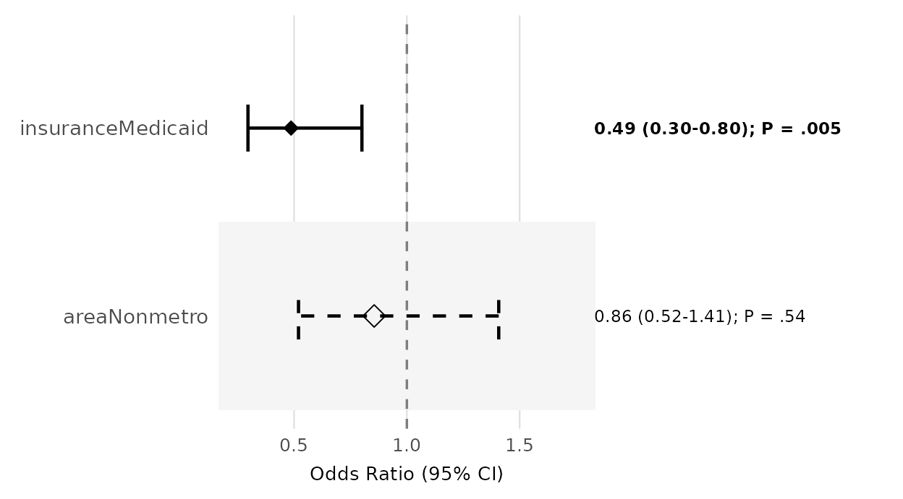
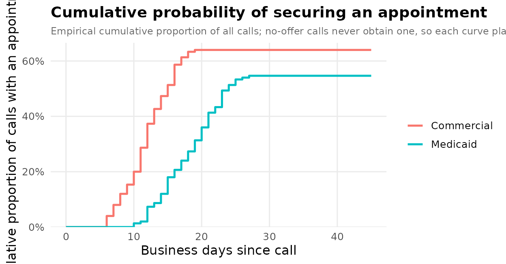
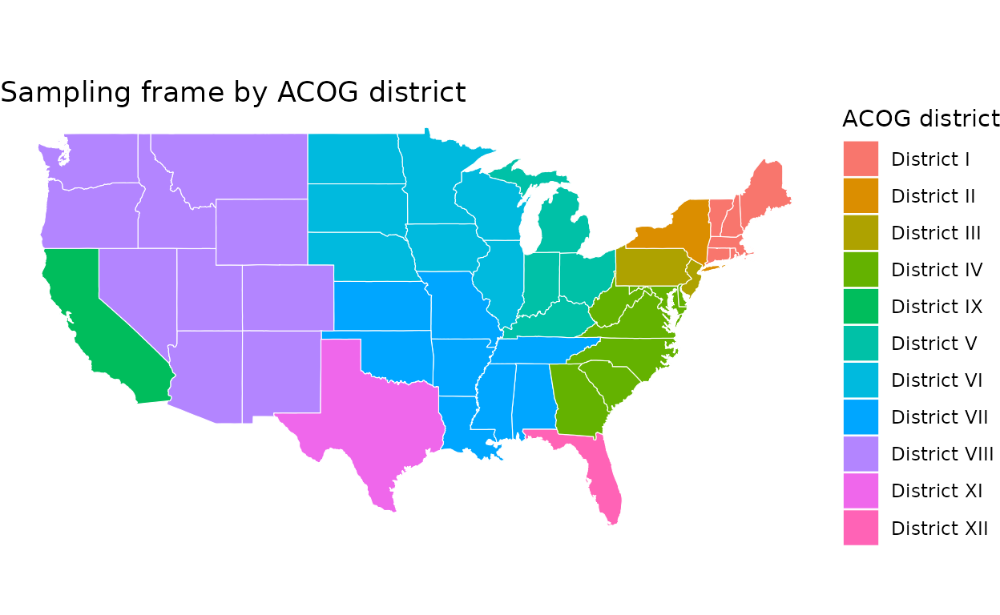
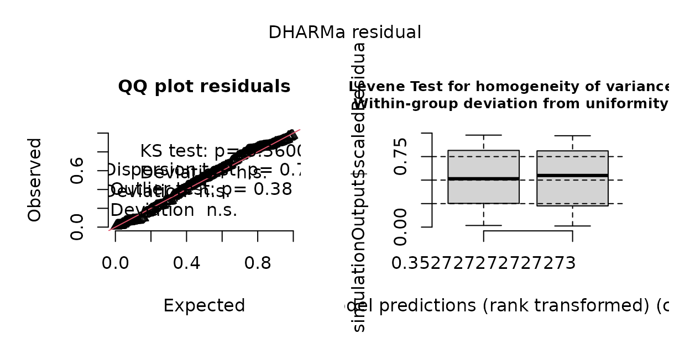

# Assembling supplementary digital content

Journals rarely print a mystery-caller study’s full model tables,
sensitivity analyses, reporting checklists, participant flow, and maps
in the main text — those go in the **supplementary digital content
(SDC)**, uploaded as separate files. This vignette assembles that
package: model equations, supplementary tables and figures, a
missingness analysis, a per-caller evaluation, maps, and two reporting
checklists, each generated from the fitted models and the call log so
the SDC stays consistent with the manuscript and regenerates itself when
the data change.

``` r

library(mysterycall)
```

## 1. The analysis behind the SDC

A mystery-caller study of insurance-based access has two outcomes —
whether an appointment was offered and the wait in business days among
offers — and a call log carrying the caller, the call date, and the
practice location. We simulate it, then fit a logistic GLMM for the
offer and a Poisson GLMM for the wait.

``` r

set.seed(2026)
n <- 150
cities <- list(CO = "Denver", TX = "Dallas", NY = "New York",
               CA = "Los Angeles", FL = "Miami", IL = "Chicago")
st <- sample(names(cities), n, TRUE)
d <- data.frame(
  npi        = rep(sprintf("1%09d", seq_len(n)), each = 2),
  insurance  = rep(c("Commercial", "Medicaid"), n),
  caller     = rep(sample(paste0("RA", 1:5), n, TRUE), each = 2),
  call_date  = rep(as.Date("2026-01-05") + sample(0:40, n, TRUE), each = 2),
  state      = rep(st, each = 2),
  city       = rep(unlist(cities)[st], each = 2),
  area       = rep(sample(c("Metro", "Nonmetro"), n, TRUE), each = 2),
  degree     = rep(sample(c("MD", "DO"), n, TRUE, c(.8, .2)), each = 2)
)
med <- d$insurance == "Medicaid"
d$reached <- rbinom(nrow(d), 1, 0.92) == 1   # some calls never reached a live office
d$appt_offered <- rbinom(nrow(d), 1, plogis(1.1 - 0.9 * med + 0.3 * (d$area == "Metro")))
# a few calls never resolved the wait (incomplete) -> missing outcome
d$wait_days <- ifelse(d$appt_offered == 1 & rbinom(nrow(d), 1, 0.9) == 1,
                      rpois(nrow(d), ifelse(med, 18, 12)), NA)

offer_crude    <- mysterycall_logistic_model(d, "appt_offered", "insurance", "npi")
offer_adjusted <- mysterycall_logistic_model(d, "appt_offered",
                                             c("insurance", "area"), "npi")
wait_model <- mysterycall_poisson_model(
  d[d$appt_offered == 1 & !is.na(d$wait_days), ], outcome = "wait_days",
  predictors = "insurance", random_intercept = "npi")
```

## 2. Model equations

Supplementary methods print the statistical model.
[`mysterycall_model_equation()`](https://mufflyt.github.io/mysterycall/reference/mysterycall_model_equation.md)
renders a fitted GLM(M) as LaTeX — no `equatiomatic` dependency —
reading the link, terms, and random intercept off the fit.

``` r

cat(mysterycall_model_equation(offer_adjusted), "\n\n")
```

``` math
\operatorname{logit}\left(\Pr(\text{appt\_offered}=1)\right) = \beta_0 + \beta_{1}\,\text{insurance} + \beta_{2}\,\text{area} + u_{\text{npi}}, \quad u_{\text{npi}} \sim \mathcal{N}(0,\ \sigma^2)
```

``` r

cat(mysterycall_model_equation(wait_model))
```

``` math
\log\left(\mathbb{E}[\text{wait\_days}]\right) = \beta_0 + \beta_{1}\,\text{insurance} + u_{\text{npi}}, \quad u_{\text{npi}} \sim \mathcal{N}(0,\ \sigma^2)
```

Pass `coefficients = TRUE` for the fitted form with numbers in place of
the $`\beta`$s; the symbolic form carries a `legend` attribute mapping
each coefficient to its term.

## 3. Supplementary tables

**Table S1 — model estimates (crude vs. adjusted).**

``` r

tS1 <- mysterycall_multi_model_table(
  list(Crude = offer_crude, Adjusted = offer_adjusted))
tS1
#> Multi-model regression table  [OR (95% CI)]
#> ------------------------------------------------------------ 
#>  Term                Crude                      Adjusted                  
#>  insuranceCommercial Ref.                       Ref.                      
#>  insuranceMedicaid   0.49 (0.30-0.80) | p=0.005 0.49 (0.30-0.80) | p=0.005
#>  areaMetro                                      Ref.                      
#>  areaNonmetro                                   0.86 (0.52-1.41) | p=0.538
#>  N                   300                        300                       
#>  AIC                 372.4                      374.0                     
#> ------------------------------------------------------------
```

**Table S2 — the disparity, with confidence intervals.**

``` r

tS2 <- mysterycall_disparities_table(d, "appt_offered", "insurance",
                                     ref_group = "Commercial")
tS2
#> Disparity table -- 2 groups | ref: 'Commercial' | wilson 95% CI
#> Group                       n  n_acc     Rate  95% CI            Abs.Diff  RR (95% CI)             p-value
#> ---------------------------------------------------------------------------------------------------- 
#> Commercial                150    114    76.0%  68.6%-82.1%          (ref)  1.00 (ref)              (ref)
#> Medicaid                  150     91    60.7%  52.7%-68.1%       -15.3 pp  0.80 (0.68-0.93)        p = 0.004
```

**Table S3 — adjusted effect on the absolute scale.**

``` r

mysterycall_combined_results_table(wait_model)
#>                Term  IRR IRR 95% CI p-value Days Diff Days 95% CI Significance
#> 1 insuranceMedicaid 1.52  1.41-1.64 < 0.001      <NA>        <NA>            *
```

**Table S4 — this study against prior work.**

``` r

prior <- data.frame(
  author = c("Pollack 2016", "Sharma 2025"), year = c(2016, 2025),
  insurance_comparison = "Medicaid vs Commercial", n = c(1200, 480),
  or = c(0.42, 0.55), ci_lower = c(0.35, 0.40), ci_upper = c(0.51, 0.75),
  specialty = c("Urology", "OBGYN"))
mysterycall_literature_table(prior)
#> 
#> -- Mystery-caller literature comparison (2 studies) --
#> 
#>        Author Year Specialty             Comparison    N      OR (95% CI)
#>  Pollack 2016 2016   Urology Medicaid vs Commercial 1200 0.42 (0.35-0.51)
#>   Sharma 2025 2025     OBGYN Medicaid vs Commercial  480 0.55 (0.40-0.75)
#>           Direction
#>  Disparity detected
#>  Disparity detected
#> 
#> OR range: 0.42-0.55
#> 
#> Discussion sentence:
#> Across 2 mystery-caller studies, ORs for Medicaid vs Commercial ranged from 0.42-0.55.
```

## 4. Missing-data analysis

Reviewers want to know whether missingness is benign.
[`mysterycall_missing_data_analysis()`](https://mufflyt.github.io/mysterycall/reference/mysterycall_missing_data_analysis.md)
quantifies it and tests whether it depends on the exposure — the
difference between “missing completely at random” and a threat to
validity.

``` r

miss <- mysterycall_missing_data_analysis(
  d, outcome_col = "wait_days", group_col = "insurance")
miss$summary
#>    variable n_observed n_missing pct_missing       test statistic df    p_value
#> 1 insurance        300         0        40.7 Chi-square  2.707681  1 0.09986607
#>   significant
#> 1       FALSE
```

## 5. Per-caller evaluation

Standardization is central to a covert audit, so the SDC should show
each caller behaved comparably.
[`mysterycall_call_productivity()`](https://mufflyt.github.io/mysterycall/reference/mysterycall_call_productivity.md)
summarizes volume and outcomes by caller; large between-caller swings in
the acceptance rate would flag a standardization problem.

``` r

mysterycall_call_productivity(
  d, caller_col = "caller", date_col = "call_date", outcome_col = "appt_offered")
#>   caller n_calls n_days calls_per_day n_accepted acceptance_rate mean_hold_sec
#> 1    RA2      74     23      3.217391         45           60.8%            NA
#> 2    RA4      58     18      3.222222         41           70.7%            NA
#> 3    RA5      58     21      2.761905         43           74.1%            NA
#> 4    RA1      56     18      3.111111         40           71.4%            NA
#> 5    RA3      54     19      2.842105         36           66.7%            NA
#>   mean_call_sec
#> 1            NA
#> 2            NA
#> 3            NA
#> 4            NA
#> 5            NA
```

## 6. Supplementary figures, at journal specification

**Figure S1 — forest plot of the offer model.**

``` r

figS1 <- mysterycall_forest_plot(offer_adjusted, x_label = "Odds ratio (95% CI)")
```


``` r

figS1
```



**Figure S2 — cumulative time to an appointment**, the correct
single-contact time-to-event display:

``` r

mysterycall_cumulative_access_curve(
  d, time_col = "wait_days", offered_col = "appt_offered",
  group_col = "insurance", horizon = 45, plot = TRUE)$plot
```



[`mysterycall_save_green_journal_figure()`](https://mufflyt.github.io/mysterycall/reference/mysterycall_save_green_journal_figure.md)
writes any figure at *Obstetrics & Gynecology* column width and print
DPI:

``` r

basename(mysterycall_save_green_journal_figure(
  figS1, file.path(sdc_dir, "figS1_forest"), layout = "single_column"))
#> [1] "figS1_forest.tiff"     "figS1_forest.pdf"      "figS1_forest.png"     
#> [4] "figS1_forest_data.csv"
```

## 7. Maps

**An interactive practice map.** Geocode the roster and drop the
practices onto a Leaflet map — an interactive supplement that print
cannot show.

``` r

practices <- unique(d[, c("npi", "city", "state", "insurance")])
g <- mysterycall_geocode_city_state(practices$city, practices$state)
practices$lat <- g$lat; practices$lon <- g$lon
leaflet::addCircleMarkers(
  leaflet::addTiles(leaflet::leaflet(practices)),
  lng = ~lon, lat = ~lat, radius = 4, stroke = FALSE, fillOpacity = 0.6,
  popup = ~paste0(city, ", ", state))
```

**A choropleth by region/district.** Assign every state its ACOG
district with
[`mysterycall_assign_region()`](https://mufflyt.github.io/mysterycall/reference/mysterycall_assign_region.md)
and shade a US map:

``` r

library(ggplot2)
us <- map_data("state")
districts <- data.frame(region = tolower(state.name),
                        district = mysterycall_assign_region(state.abb))
choro <- merge(us, districts, by = "region")
choro <- choro[order(choro$order), ]
ggplot(choro, aes(long, lat, group = group, fill = district)) +
  geom_polygon(colour = "white", linewidth = 0.2) +
  coord_quickmap() + theme_void() +
  labs(fill = "ACOG district", title = "Sampling frame by ACOG district")
```



([`mysterycall_region_labels()`](https://mufflyt.github.io/mysterycall/reference/mysterycall_region_labels.md)
returns the same state-to-region assignment with centroids for
labelling.)

## 8. Reporting checklists

Observational studies ship a **STROBE** checklist, built from the fitted
model:

``` r

head(mysterycall_strobe_checklist(wait_model), 6)
#> STROBE Checklist for Mystery-Caller Study
#> ================================================== 
#> [WARN] Item  1  Title/Abstract: Study design stated in title or abstract
#>          Cannot auto-detect; verify manually.
#> [WARN] Item  2  Introduction: Scientific background and objectives stated
#>          Cannot auto-detect; verify manually.
#> [WARN] Item  3  Methods: Setting, locations, and dates described
#>          Cannot auto-detect; verify manually.
#> [WARN] Item  4  Methods: Eligibility criteria for participants stated
#>          Cannot auto-detect; verify manually.
#> [WARN] Item  5  Methods: Mystery-caller protocol described (script, blinding, call timing)
#>          Cannot auto-detect; verify manually.
#> [WARN] Item  6  Methods: Sample size justified
#>          No power/sample_size field found. Verify that a power analysis is reported.
#> 
#> Summary: 0 PASS, 6 WARN, 0 FAIL
```

But mystery-caller studies are *simulated-patient* research, and STROBE
omits the covert-methodology items reviewers ask for — why the covert
method was justified, how callers were trained, how detection was
handled, how the deception was ethically managed.
[`mysterycall_crisp_checklist()`](https://mufflyt.github.io/mysterycall/reference/mysterycall_crisp_checklist.md)
supplies that companion:

``` r

crisp <- mysterycall_crisp_checklist()
crisp[crisp$section %in% c("Callers", "Detection", "Ethics"),
      c("section", "item")]
#> <CRiSP-style simulated-patient reporting checklist: 6 items, 3 sections>
#>    section                                   item
#>    Callers Caller recruitment and characteristics
#>    Callers                        Caller training
#>    Callers             Standardization monitoring
#>  Detection            Detection and contamination
#>     Ethics         Ethical approval and deception
#>     Ethics                        Provider burden
```

The participant-flow diagram (Figure S-flow) comes from
[`mysterycall_flowchart()`](https://mufflyt.github.io/mysterycall/reference/mysterycall_flowchart.md),
which renders with the DiagrammeR package:

``` r

mysterycall_flowchart(
  counts = c("Sampled" = 240, "Reached" = 226, "Analyzed" = 218))
```

## 9. Sensitivity analyses

A covert audit invites a predictable set of “but what if…” questions,
and the SDC is where you answer them. Two are near-universal.

**Non-response bounds.** Not every call reaches a live office, so the
offer rate is not point-identified. Rather than quietly condition on
completed calls,
[`mysterycall_outcome_bounds()`](https://mufflyt.github.io/mysterycall/reference/mysterycall_outcome_bounds.md)
reports the assumption-free interval — assign every unreached call first
to failure, then to success:

``` r

mysterycall_outcome_bounds(d, "appt_offered", observed = "reached")
#> <mysterycall outcome bounds under non-response>
#>   universe 300 = observed 280 + missing 20; positives 191
#>   complete-case rate: 68.2%  (95% CI 62.5%-73.4%)
#>   bounds over universe: [63.7% (all missing fail), 70.3% (all succeed)]  width 6.7%
```

**Leave-one-caller-out.** Confirm the exposure effect does not hinge on
a single research assistant by refitting with each caller dropped in
turn:

``` r

fit_glm <- glm(appt_offered ~ insurance + area, binomial, d)
mysterycall_leave_one_out(fit_glm, d, group = "caller", term = "insuranceMedicaid")
#> <mysterycall leave-one-group-out: term 'insuranceMedicaid', 5 refits>
#>   full-data ratio: 0.49 (p = 0.00459)
#> # A tibble: 5 × 7
#>   group_excluded     n estimate ratio std_error p_value converged
#>   <chr>          <int>    <dbl> <dbl>     <dbl>   <dbl> <lgl>    
#> 1 RA1              244   -0.570 0.566     0.278 0.0405  TRUE     
#> 2 RA2              226   -0.786 0.455     0.301 0.00910 TRUE     
#> 3 RA3              246   -0.730 0.482     0.282 0.00956 TRUE     
#> 4 RA4              242   -0.614 0.541     0.280 0.0284  TRUE     
#> 5 RA5              242   -0.918 0.399     0.283 0.00119 TRUE
```

Other analyses worth including, each a single call: the wait model under
an alternative count family
([`mysterycall_compare_count_families()`](https://mufflyt.github.io/mysterycall/reference/mysterycall_compare_count_families.md)),
calendar vs. business days
([`mysterycall_calendar_sensitivity()`](https://mufflyt.github.io/mysterycall/reference/mysterycall_calendar_sensitivity.md)),
a stricter outcome definition (re-fit on “offer with the sampled
physician”), and Benjamini–Hochberg-adjusted p-values
([`mysterycall_multiple_comparison_adjust()`](https://mufflyt.github.io/mysterycall/reference/mysterycall_multiple_comparison_adjust.md)).

## 10. Baseline characteristics (Table 1)

Reviewers want to know who was sampled.
[`mysterycall_table1()`](https://mufflyt.github.io/mysterycall/reference/mysterycall_table1.md)
builds a publication-ready baseline table at the practice level:

``` r

practices <- unique(d[, c("npi", "state", "area", "degree")])
mysterycall_table1(practices, covariates = c("state", "degree"),
                   stratify_by = "area", include_overall = TRUE)
#> Table 1 (Overall N=150, Metro N=67, Nonmetro N=83)
#> Stratified by: area
#> 
#> # A tibble: 8 × 6
#>   variable level Overall     `Metro (N=67)` `Nonmetro (N=83)` p_value
#>   <chr>    <chr> <chr>       <chr>          <chr>             <chr>  
#> 1 state    CA    29 (19.3%)  16 (23.9%)     13 (15.7%)        0.046  
#> 2 state    CO    27 (18.0%)  12 (17.9%)     15 (18.1%)        NA     
#> 3 state    FL    36 (24.0%)  11 (16.4%)     25 (30.1%)        NA     
#> 4 state    IL    15 (10.0%)  4 (6.0%)       11 (13.3%)        NA     
#> 5 state    NY    20 (13.3%)  14 (20.9%)     6 (7.2%)          NA     
#> 6 state    TX    23 (15.3%)  10 (14.9%)     13 (15.7%)        NA     
#> 7 degree   DO    42 (28.0%)  16 (23.9%)     26 (31.3%)        0.313  
#> 8 degree   MD    108 (72.0%) 51 (76.1%)     57 (68.7%)        NA
```

## 11. Full model output: ICC and variance components

The SDC should report more than the exposure coefficient — the
clustering matters.
[`mysterycall_icc()`](https://mufflyt.github.io/mysterycall/reference/mysterycall_icc.md)
gives the intraclass correlation (how much of the variation sits between
practices), and
[`mysterycall_random_effect_variance()`](https://mufflyt.github.io/mysterycall/reference/mysterycall_random_effect_variance.md)
the variance components:

``` r

mysterycall_icc(wait_model)
#> Intraclass Correlation Coefficient (latent_variable_poisson)
#>   ICC       = 0.0000
#>   sigma2_u  = 0.0000  (physician random-intercept variance)
#> 
#> ICC = 0.000: 0.0% of outcome variance is attributable to between-physician clustering.
mysterycall_random_effect_variance(wait_model$model)
#> $icc
#> [1] 0
#> 
#> $random_variance
#> [1] 0
#> 
#> $residual_variance
#> [1] 3.289868
#> 
#> $random_effect_group
#> [1] "npi"
#> 
#> $var_table
#>   grp        var1 var2 vcov sdcor Significant
#> 1 npi (Intercept) <NA>    0     0          No
#> 
#> $interpretation
#> [1] "low"
#> 
#> $sentence
#> [1] "The intraclass correlation (ICC) of the model for the random effect group 'npi' is 0. An ICC of 0 is considered low, suggesting that most variance is at the individual level rather than between groups of 'npi'."
```

## 12. A priori power

Journals require the pre-specified power calculation.
[`mysterycall_poisson_power()`](https://mufflyt.github.io/mysterycall/reference/mysterycall_poisson_power.md)
sizes the wait-time comparison for a target incidence-rate ratio:

``` r

mysterycall_poisson_power(irr = 1.40, lambda_ref = 14, power = 0.80,
                          both_arms = TRUE)
#> $n_per_arm
#> [1] 9
#> 
#> $n_total
#> [1] 9
#> 
#> $n_total_calls
#> [1] 18
#> 
#> $irr
#> [1] 1.4
#> 
#> $lambda_ref
#> [1] 14
#> 
#> $lambda_trt
#> [1] 19.6
#> 
#> $alpha
#> [1] 0.05
#> 
#> $power
#> [1] 0.8
#> 
#> $design_effect
#> [1] 1
```

## 13. Model diagnostics

A residual figure justifies the model.
[`mysterycall_plot_residuals()`](https://mufflyt.github.io/mysterycall/reference/mysterycall_plot_residuals.md)
draws the diagnostic panel, and the fitted object already carries the
overdispersion check:

``` r

mysterycall_plot_residuals(wait_model)
```



## 14. Reproducibility

Finally, a reproducibility appendix — the R and package versions the
analysis ran under, so the SDC is a complete, re-runnable record:

``` r

mysterycall_session_snapshot(
  file = file.path(sdc_dir, "session_snapshot.txt"), quiet = TRUE,
  notes = "Supplementary digital content build")
```

## 15. Export and manifest

Write each artifact in the format the journal wants — a CSV per table is
the most portable,
[`mysterycall_export_results_docx()`](https://mufflyt.github.io/mysterycall/reference/mysterycall_export_results_docx.md)
gives formatted Word (needs officer/flextable), and
[`mysterycall_supplemental_tables()`](https://mufflyt.github.io/mysterycall/reference/mysterycall_supplemental_tables.md)
bundles every model table into one workbook (needs openxlsx):

``` r

write.csv(as.data.frame(tS1), file.path(sdc_dir, "TableS1_models.csv"),
          row.names = FALSE)
write.csv(tS2, file.path(sdc_dir, "TableS2_disparities.csv"), row.names = FALSE)
write.csv(as.data.frame(crisp), file.path(sdc_dir, "ChecklistS1_CRiSP.csv"),
          row.names = FALSE)
```

``` r

mysterycall_supplemental_tables(
  logistic_fit = offer_adjusted, poisson_fit = wait_model,
  file = file.path(sdc_dir, "supplemental_tables.xlsx"), overwrite = TRUE)
```

Finally, a manifest — reviewers appreciate it, and it doubles as a build
check:

``` r

files <- list.files(sdc_dir)
data.frame(
  file = files,
  kind = ifelse(grepl("\\.csv$", files), "table",
         ifelse(grepl("\\.(png|pdf|tiff)$", files), "figure",
         ifelse(grepl("\\.xlsx$", files), "bundle", "other"))))
#>                       file   kind
#> 1    ChecklistS1_CRiSP.csv  table
#> 2    figS1_forest_data.csv  table
#> 3         figS1_forest.pdf figure
#> 4         figS1_forest.png figure
#> 5        figS1_forest.tiff figure
#> 6     session_snapshot.txt  other
#> 7 supplemental_tables.xlsx bundle
#> 8       TableS1_models.csv  table
#> 9  TableS2_disparities.csv  table
```

## Recap

Every piece of a mystery-caller study’s supplementary digital content —
the model equations, a baseline Table 1, the crude-vs-adjusted and
disparity tables, the ICC and variance components, the missingness
analysis, the per-caller evaluation, the a-priori power calculation, the
forest, cumulative-access, and residual figures at journal
specification, the practice and district maps, the STROBE **and** CRiSP
reporting checklists, non-response and leave-one-caller-out sensitivity
analyses, and a reproducibility appendix — comes from the same fitted
models and call log with one call apiece, so the SDC regenerates itself
whenever the analysis is re-run.
